Linkage analysis for H.zea CHR13 marker with larval growth
================
Katherine Taylor and Megan Fritz
written Jan. 8, 2021

## Parental strains used for linkage analysis

Summary statistics and distributions of 7 day larval weights for the strains used as grandparents for linkage analysis crosses. The Benzon strain was used as the susceptible strain (dark grey) and a field-collected population from MD was used as the resistant strain. Panel A shows the distributions of weights on a diagnostic dose of a diet with BC0805 (Cry1Ab) leaf tissue incorporation. Panel B shows the distributions of weights on Obsession II (Cry1A.105+Cry2Ab2) leaf tissue.

``` r
F0_growth %>% 
   filter(end_weight_mg != "") %>% 
   group_by(diet_strain, field) %>%
   summarize(
     count = n(),
     mean = mean(end_weight_mg),
     median = median(end_weight_mg),
     sd = sd(end_weight_mg)
   )
```

    ## # A tibble: 4 x 6
    ## # Groups:   diet_strain [2]
    ##   diet_strain field  count   mean median    sd
    ##   <fct>       <chr>  <int>  <dbl>  <dbl> <dbl>
    ## 1 O           Benzon   102   6.46    5.1  5.30
    ## 2 O           Field    147  86.9    78.1 38.5 
    ## 3 P           Benzon   101  19.9    15.3 13.2 
    ## 4 P           Field    148 115.    114.  38.2

``` r
#parents on BC0805
panelA <- F0_growth %>%
   filter(diet_strain == "P", end_weight_mg != "") %>%
   ggplot(aes(x = end_weight_mg, fill = field)) +
   geom_histogram(alpha = 0.5, position = "identity", bins = 20, color="black") +
   labs(x = "Weight (mg)", y = "Count", tag = "A") +
   theme_bw() + theme(panel.grid.major = element_blank(), panel.grid.minor = element_blank(), panel.background = element_blank()) +
   scale_fill_manual(name="field",
                          breaks = c("Benzon", "Field"),
                           labels = c("Susceptible", "MD"),
                          values = c("grey20", "grey80")) +
   scale_y_continuous(limits = c(0, 55), breaks = c(0, 20, 40, 60)) +
   theme(axis.text=element_text(size=12),
         axis.title=element_text(size=14,face="bold"))+
   theme(legend.position = "none") 

panelA
```


``` r
#Parents on ObsII
panelB <- F0_growth %>%
   filter(diet_strain == "O", end_weight_mg != "") %>%
   ggplot(aes(x = end_weight_mg, fill = field)) +
    geom_histogram(alpha = 0.5, position = "identity", bins = 20, color="black") +
   labs(x = "Weight (mg)", y = "Count", tag = "B") +
   theme_bw() + theme(panel.grid.major = element_blank(), panel.grid.minor = element_blank(), panel.background = element_blank()) +
   scale_fill_manual(name = "Population",
                          breaks = c("Benzon", "Field"),
                           labels = c("Susceptible", "MD"),
                          values = c("grey20", "grey80"))  +
   scale_y_continuous(limits = c(0, 55), breaks = c(0, 20, 40, 60)) + theme(legend.position = "none") +
   theme(axis.text=element_text(size=12),
         axis.title=element_text(size=14,face="bold")) 
 
panelB
```


## Testing for differences in final weight between the parental strains

``` r
#subsetting the data by diet treatment
F0_BC0805 <- subset(F0_growth, diet_strain == "P")
F0_ObsII <- subset(F0_growth, diet_strain == "O")


#BC0805 treatment first.
fitF0_P <- aov(end_weight_mg ~ field, data = F0_BC0805)
summary(fitF0_P)#shows statistically significant differences between parental pops
```

    ##              Df Sum Sq Mean Sq F value Pr(>F)    
    ## field         1 538020  538020   572.7 <2e-16 ***
    ## Residuals   247 232045     939                   
    ## ---
    ## Signif. codes:  0 '***' 0.001 '**' 0.01 '*' 0.05 '.' 0.1 ' ' 1
    ## 2 observations deleted due to missingness

``` r
shapiro.test(resid(fitF0_P))#BC0805 dataset meets assumptions of normality, but barely.
```

    ## 
    ##  Shapiro-Wilk normality test
    ## 
    ## data:  resid(fitF0_P)
    ## W = 0.9897, p-value = 0.07405

``` r
boxcox(fitF0_P, plotit = TRUE)
```


``` r
#fitting a glm
fitF0_P1 <- glm(end_weight_mg ~ 1 + field, data = F0_BC0805, family = "gaussian")
summary(fitF0_P1)
```

    ## 
    ## Call:
    ## glm(formula = end_weight_mg ~ 1 + field, family = "gaussian", 
    ##     data = F0_BC0805)
    ## 
    ## Deviance Residuals: 
    ##     Min       1Q   Median       3Q      Max  
    ## -93.767  -16.098   -2.967   18.533   97.533  
    ## 
    ## Coefficients:
    ##             Estimate Std. Error t value Pr(>|t|)    
    ## (Intercept)   19.898      3.050   6.524 3.84e-10 ***
    ## fieldField    94.669      3.956  23.931  < 2e-16 ***
    ## ---
    ## Signif. codes:  0 '***' 0.001 '**' 0.01 '*' 0.05 '.' 0.1 ' ' 1
    ## 
    ## (Dispersion parameter for gaussian family taken to be 939.4549)
    ## 
    ##     Null deviance: 770065  on 248  degrees of freedom
    ## Residual deviance: 232045  on 247  degrees of freedom
    ##   (2 observations deleted due to missingness)
    ## AIC: 2415.1
    ## 
    ## Number of Fisher Scoring iterations: 2

``` r
fitF0_P2 <- glm(end_weight_mg ~ 1 + field, data = F0_BC0805, family = "Gamma")
summary(fitF0_P2)#this is the better fit according to AIC
```

    ## 
    ## Call:
    ## glm(formula = end_weight_mg ~ 1 + field, family = "Gamma", data = F0_BC0805)
    ## 
    ## Deviance Residuals: 
    ##     Min       1Q   Median       3Q      Max  
    ## -1.8572  -0.3830  -0.0476   0.2601   1.4262  
    ## 
    ## Coefficients:
    ##              Estimate Std. Error t value Pr(>|t|)    
    ## (Intercept)  0.050256   0.002471   20.34   <2e-16 ***
    ## fieldField  -0.041528   0.002496  -16.64   <2e-16 ***
    ## ---
    ## Signif. codes:  0 '***' 0.001 '**' 0.01 '*' 0.05 '.' 0.1 ' ' 1
    ## 
    ## (Dispersion parameter for Gamma family taken to be 0.2441351)
    ## 
    ##     Null deviance: 218.37  on 248  degrees of freedom
    ## Residual deviance:  68.06  on 247  degrees of freedom
    ##   (2 observations deleted due to missingness)
    ## AIC: 2340.4
    ## 
    ## Number of Fisher Scoring iterations: 5

``` r
#looking at distributions again
plot(fitF0_P1)
```


``` r
plot(fitF0_P2)#this does look better....
```


``` r
#model comparison with and without field.
fitF0_P2red <- glm(end_weight_mg ~ 1, data = F0_BC0805, family = "Gamma")

lrtest(fitF0_P2red,fitF0_P2)#statistically sig diff again
```

    ## Likelihood ratio test
    ## 
    ## Model 1: end_weight_mg ~ 1
    ## Model 2: end_weight_mg ~ 1 + field
    ##   #Df  LogLik Df  Chisq Pr(>Chisq)    
    ## 1   2 -1324.5                         
    ## 2   3 -1167.2  1 314.57  < 2.2e-16 ***
    ## ---
    ## Signif. codes:  0 '***' 0.001 '**' 0.01 '*' 0.05 '.' 0.1 ' ' 1

``` r
#ObsII treatment second
fitF0_O <- aov(end_weight_mg ~ field, data = F0_ObsII)
summary(fitF0_O) #statistically significant differences between strains.
```

    ##              Df Sum Sq Mean Sq F value Pr(>F)    
    ## field         1 389935  389935     440 <2e-16 ***
    ## Residuals   247 218896     886                   
    ## ---
    ## Signif. codes:  0 '***' 0.001 '**' 0.01 '*' 0.05 '.' 0.1 ' ' 1

``` r
shapiro.test(resid(fitF0_O))#ObsII does not meet assumptions of normality.
```

    ## 
    ##  Shapiro-Wilk normality test
    ## 
    ## data:  resid(fitF0_O)
    ## W = 0.93289, p-value = 3.22e-09

``` r
boxcox(fitF0_O, plotit = TRUE)
```


``` r
#trying a log10 transformation first
fitF0_OL <- aov(log10(end_weight_mg) ~ field, data = F0_ObsII)
summary(fitF0_OL)
```

    ##              Df Sum Sq Mean Sq F value Pr(>F)    
    ## field         1  86.34   86.34    1188 <2e-16 ***
    ## Residuals   247  17.95    0.07                   
    ## ---
    ## Signif. codes:  0 '***' 0.001 '**' 0.01 '*' 0.05 '.' 0.1 ' ' 1

``` r
shapiro.test(resid(fitF0_OL))#helps alot, but still does not quite meet assumptions of normality
```

    ## 
    ##  Shapiro-Wilk normality test
    ## 
    ## data:  resid(fitF0_OL)
    ## W = 0.98083, p-value = 0.001924

``` r
#fitting a glm
fitF0_O1 <- glm(end_weight_mg ~ 1 + field, data = F0_ObsII, family = "gaussian")
summary(fitF0_O1)
```

    ## 
    ## Call:
    ## glm(formula = end_weight_mg ~ 1 + field, family = "gaussian", 
    ##     data = F0_ObsII)
    ## 
    ## Deviance Residuals: 
    ##     Min       1Q   Median       3Q      Max  
    ## -77.034  -17.734   -2.264    7.166  107.266  
    ## 
    ## Coefficients:
    ##             Estimate Std. Error t value Pr(>|t|)    
    ## (Intercept)    6.464      2.948   2.193   0.0292 *  
    ## fieldField    80.471      3.836  20.976   <2e-16 ***
    ## ---
    ## Signif. codes:  0 '***' 0.001 '**' 0.01 '*' 0.05 '.' 0.1 ' ' 1
    ## 
    ## (Dispersion parameter for gaussian family taken to be 886.2194)
    ## 
    ##     Null deviance: 608831  on 248  degrees of freedom
    ## Residual deviance: 218896  on 247  degrees of freedom
    ## AIC: 2400.6
    ## 
    ## Number of Fisher Scoring iterations: 2

``` r
fitF0_O2 <- glm(end_weight_mg ~ 1 + field, data = F0_ObsII, family = "Gamma")
summary(fitF0_O2)#this is the better fit according to AIC
```

    ## 
    ## Call:
    ## glm(formula = end_weight_mg ~ 1 + field, family = "Gamma", data = F0_ObsII)
    ## 
    ## Deviance Residuals: 
    ##     Min       1Q   Median       3Q      Max  
    ## -1.6041  -0.4540  -0.1569   0.2915   2.4930  
    ## 
    ## Coefficients:
    ##              Estimate Std. Error t value Pr(>|t|)    
    ## (Intercept)  0.154710   0.009573   16.16   <2e-16 ***
    ## fieldField  -0.143207   0.009591  -14.93   <2e-16 ***
    ## ---
    ## Signif. codes:  0 '***' 0.001 '**' 0.01 '*' 0.05 '.' 0.1 ' ' 1
    ## 
    ## (Dispersion parameter for Gamma family taken to be 0.3905234)
    ## 
    ##     Null deviance: 380.882  on 248  degrees of freedom
    ## Residual deviance:  88.101  on 247  degrees of freedom
    ## AIC: 2073.9
    ## 
    ## Number of Fisher Scoring iterations: 6

``` r
#looking at distributions again
plot(fitF0_O1)
```


``` r
plot(fitF0_O2)#this does look better....
```


``` r
#model comparison with and without field.
fitF0_O2red <- glm(end_weight_mg ~ 1, data = F0_ObsII, family = "Gamma")

lrtest(fitF0_O2red,fitF0_O2)#statistically sig diff again
```

    ## Likelihood ratio test
    ## 
    ## Model 1: end_weight_mg ~ 1
    ## Model 2: end_weight_mg ~ 1 + field
    ##   #Df  LogLik Df  Chisq Pr(>Chisq)    
    ## 1   2 -1238.9                         
    ## 2   3 -1034.0  1 409.97  < 2.2e-16 ***
    ## ---
    ## Signif. codes:  0 '***' 0.001 '**' 0.01 '*' 0.05 '.' 0.1 ' ' 1

## First mapping family - untreated vs. Cry1Ab leaf tissue incorporation assay

One F2 mapping family was generated and split into two groups at 48h after hatching - half were placed on diet with untreated leaf tissue (orange), the other half were placed on diet containing Cry1Ab treated leaf tissue (blue). A second F2 mapping family was generated and also split into two groups at 48h after hatching - half were placed on diet containing Cry1A.105 + Cry2Ab2 treated leaf tissue (purple). While we put the other half of the family on diet with untreated leaf tissue from a sweet corn isoline with the same genetic background as the two-toxin treated tissue, the data are not shown for simplicity. All larvae were allowed to feed for 7 days and then weighed.

``` r
#good plot for presentation
joined %>%
  filter (genotype_9409b != "") %>%
ggplot(aes(x = genotype_9409b, y = end_weight_mg, fill = TreatByFam, color = TreatByFam)) +
  geom_boxplot(fatten = 1, alpha = 0.8, notch = F) +
  geom_point(position=position_jitterdodge(jitter.width = 0.3)) +
  labs(y = "Weight (mg)", x = "") +
  theme_bw() + theme(panel.grid.major = element_blank(), panel.grid.minor = element_blank(), panel.background = element_blank()) +
  scale_y_continuous(breaks = c(0, 100, 200, 300)) +
  ylim(0,350) +
  scale_x_discrete(breaks  = c("GG", "AG", "AA"),
                   labels = c("A", "A/V", "V")) +
  scale_fill_manual(name="Treatment By Family",
                         breaks=c("Fam 1 CL", "Fam 1 DD", "Fam 2 DD"),
                         values=c("#E69F00", "#56B4E9", "#9932CC")) +
  scale_color_manual(name="Treatment By Family ",
                         breaks=c("Fam 1 CL", "Fam 1 DD", "Fam 2 DD"),
                         values=c("#E69F00", "#56B4E9", "#9932CC")) +
  theme(axis.text=element_text(size=12),
         axis.title=element_text(size=14,face="bold"))
```

    ## Scale for 'y' is already present. Adding another scale for 'y', which will
    ## replace the existing scale.

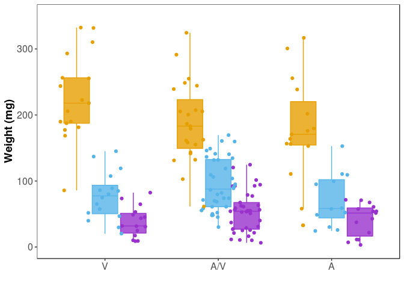

``` r
#individual plots by family/treat
BV_BA52_BZM_P11_A1_CL %>%
ggplot(aes(x = genotype_9409b, y = end_weight_mg)) +
  geom_boxplot(fatten = 1, fill='#A4A4A4', color="black") + geom_jitter(position=position_jitter(0.2)) +
  theme_bw() + theme(panel.grid.major = element_blank(), panel.grid.minor = element_blank(), panel.background = element_blank()) +
  labs(y = "Weight (mg)", x = "", tag = "C") +
  scale_y_continuous(limits = c(0,400), breaks = c(0, 50, 100, 150, 200, 250, 300, 350)) +
  scale_x_discrete(breaks  = c("GG", "AG", "AA"), labels = c("A", "A/V", "V")) +
  theme(axis.text=element_text(size=14), 
        axis.title=element_text(size=16,face="bold"))
```

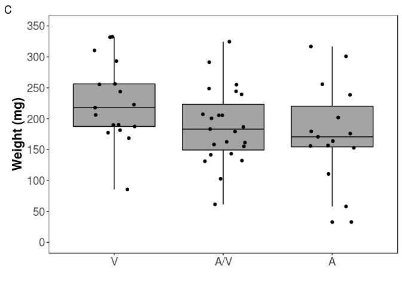

``` r
BV_BA52_BZM_P11_A1_DD %>%
ggplot(aes(x = genotype_9409b, y = end_weight_mg)) +
  geom_boxplot(fatten = 1, fill='#A4A4A4', color="black") + geom_jitter(position=position_jitter(0.2)) +
  theme_bw() + theme(panel.grid.major = element_blank(), panel.grid.minor = element_blank(), panel.background = element_blank()) +
  labs(y = "Weight (mg)", x = "", tag = "D") +
  scale_y_continuous(limits = c(0,350), breaks = c(0, 50, 100, 150, 200, 250, 300, 350)) +
  scale_x_discrete(breaks  = c("GG", "AG", "AA"),
                   labels = c("A", "A/V", "V")) +
  theme(axis.text=element_text(size=14),
         axis.title=element_text(size=16,face="bold"))
```

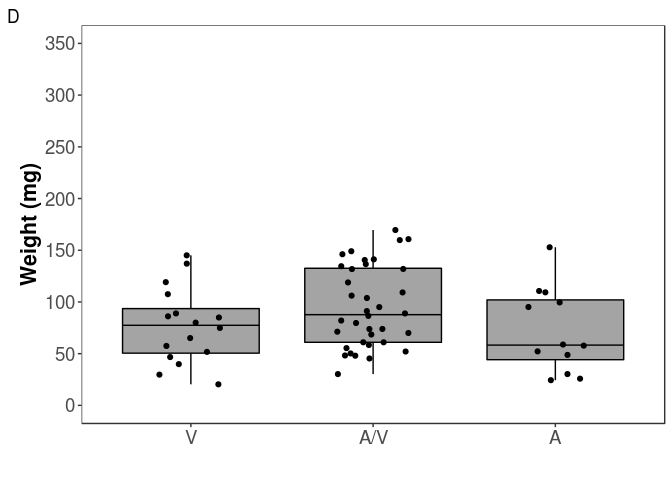

``` r
BV_CV98_03_BZF_I9_DD %>%
ggplot(aes(x = genotype_9409b, y = end_weight_mg)) +
  geom_boxplot(fatten = 1, fill='#A4A4A4', color="black") + geom_jitter(position=position_jitter(0.2)) +
  theme_bw() + theme(panel.grid.major = element_blank(), panel.grid.minor = element_blank(), panel.background = element_blank()) +
  labs(y = "Weight (mg)", x = "", tag = "E") +
  scale_y_continuous(limits = c(0,350), breaks = c(0, 50, 100, 150, 200, 250, 300,350)) +
  scale_x_discrete(breaks  = c("GG", "AG", "AA"),
                   labels = c("A", "A/V", "V")) +
 theme(axis.text=element_text(size=14),
         axis.title=element_text(size=16,face="bold"))
```

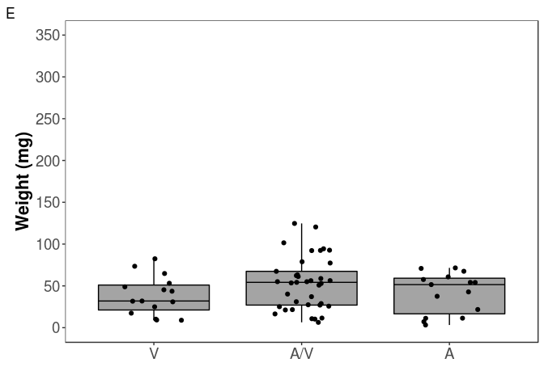

## Counts of larvae with each genotype & test for mendelian seg

``` r
exp_props <- c(0.25, 0.5, 0.25)

geno9409_dist_BCO805_DD <- as.matrix(table(BV_BA52_BZM_P11_A1_DD$genotype_9409b))#allele freqs diag dose BC0805
print(geno9409_dist_BCO805_DD[-1,])#AA is the derived genotype in the field
```

    ## AA AG GG 
    ## 16 36 12

``` r
chisq.test(x = geno9409_dist_BCO805_DD[-1,], p = exp_props, simulate.p.value = T)
```

    ## 
    ##  Chi-squared test for given probabilities with simulated p-value (based
    ##  on 2000 replicates)
    ## 
    ## data:  geno9409_dist_BCO805_DD[-1, ]
    ## X-squared = 1.5, df = NA, p-value = 0.4918

``` r
geno9409_dist_BCO805_CL <- as.matrix(table(BV_BA52_BZM_P11_A1_CL$genotype_9409b))#allele freqs control diet
print(geno9409_dist_BCO805_CL[-1,])#AA is the derived genotype in the field
```

    ## AA AG GG 
    ## 17 23 15

``` r
chisq.test(x = geno9409_dist_BCO805_CL[-1,], p = exp_props, simulate.p.value = T)
```

    ## 
    ##  Chi-squared test for given probabilities with simulated p-value (based
    ##  on 2000 replicates)
    ## 
    ## data:  geno9409_dist_BCO805_CL[-1, ]
    ## X-squared = 1.6182, df = NA, p-value = 0.4503

``` r
geno9409_dist_Obs_DD <- as.matrix(table(BV_CV98_03_BZF_I9_DD $genotype_9409b))#allele freqs control diet
print(geno9409_dist_Obs_DD)#AA is the derived genotype in the field
```

    ##    [,1]
    ## AA   15
    ## AG   37
    ## GG   15

``` r
chisq.test(x = geno9409_dist_Obs_DD, p = exp_props, simulate.p.value = T)
```

    ## 
    ##  Chi-squared test for given probabilities with simulated p-value (based
    ##  on 2000 replicates)
    ## 
    ## data:  geno9409_dist_Obs_DD
    ## X-squared = 0.73134, df = NA, p-value = 0.7281

## Anova and data transformation

We check the assumptions with plots and a shapiro test and then run a boxcox test to determine the appropiate transformation. The lambda value of ~0.5 suggests a square root transformation for individuals on treated diet. Nothing needed for controls.

Progeny on treated diet

``` r
fitDD <- aov(end_weight_mg ~ genotype_9409b, data = BV_BA52_BZM_P11_A1_DD)

shapiro.test(resid(fitDD))
```

    ## 
    ##  Shapiro-Wilk normality test
    ## 
    ## data:  resid(fitDD)
    ## W = 0.95212, p-value = 0.01457

``` r
plot(fitDD)
```

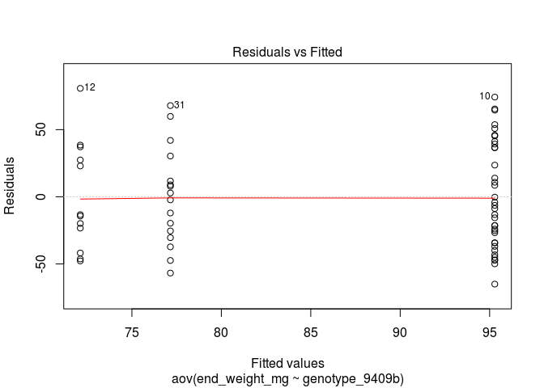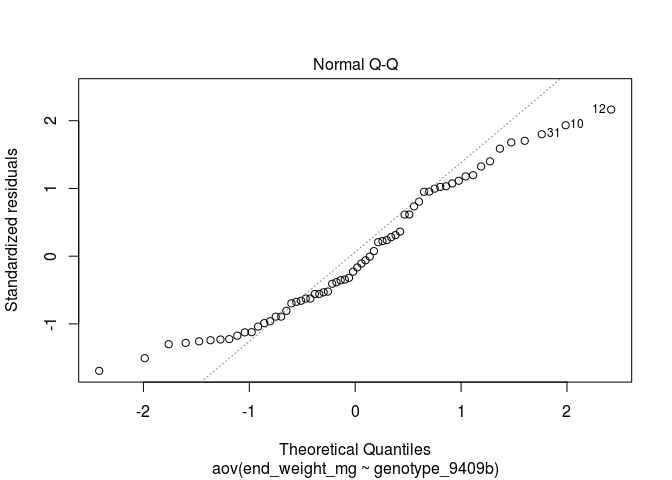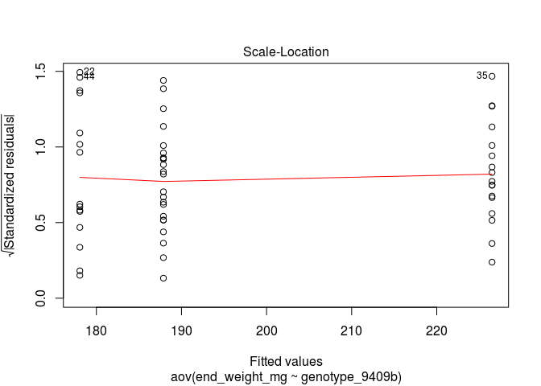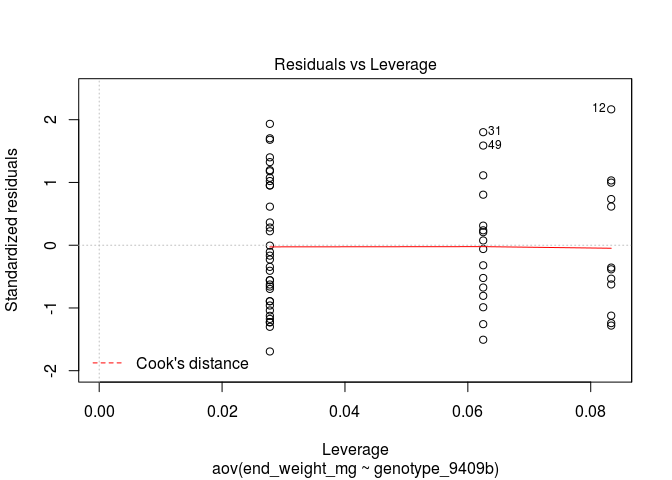

``` r
boxcox(fitDD, plotit = TRUE)
```


Progeny on untreated diet

``` r
fitCL <- aov(end_weight_mg ~ genotype_9409b, data = BV_BA52_BZM_P11_A1_CL)

shapiro.test(resid(fitCL))#no transformation needed.
```

    ## 
    ##  Shapiro-Wilk normality test
    ## 
    ## data:  resid(fitCL)
    ## W = 0.97407, p-value = 0.2786

``` r
plot(fitCL)
```

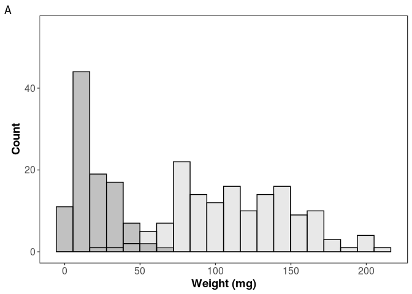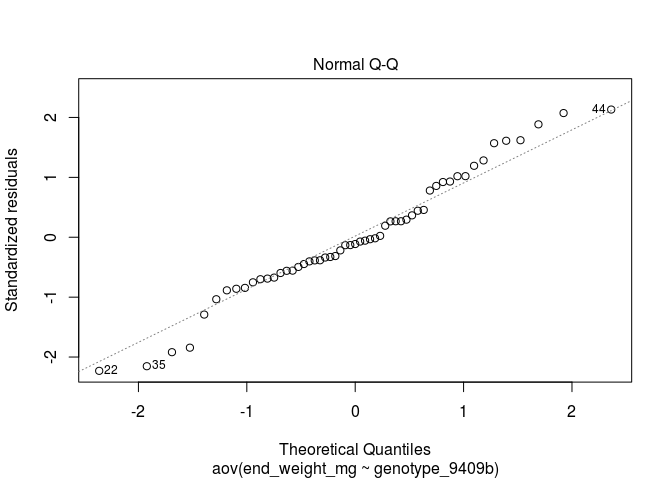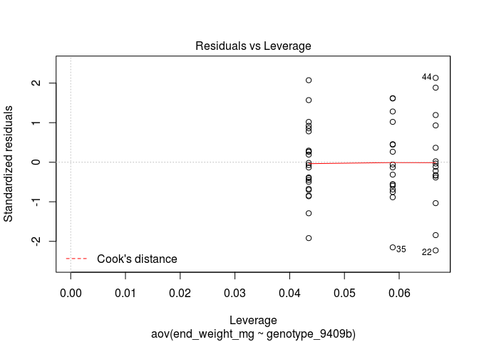

``` r
boxcox(fitCL, plotit = TRUE)
```

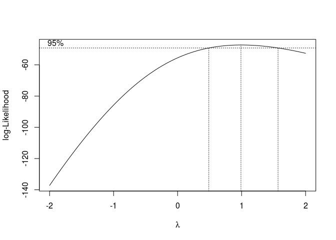

For progeny on treated diet, trying a non-parametric test because the residuals are not normally distributed.

``` r
kruskal.test(end_weight_mg ~ genotype_9409b, data = BV_BA52_BZM_P11_A1_DD)
```

    ## 
    ##  Kruskal-Wallis rank sum test
    ## 
    ## data:  end_weight_mg by genotype_9409b
    ## Kruskal-Wallis chi-squared = 3.586, df = 2, p-value = 0.1665

Then tried a parametric test with sqrt transformed responses.

``` r
fit_BV_BA52_BZM_P11_A1_DD <- aov(sqrt(end_weight_mg) ~ genotype_9409b, data = BV_BA52_BZM_P11_A1_DD)
summary(fit_BV_BA52_BZM_P11_A1_DD)
```

    ##                Df Sum Sq Mean Sq F value Pr(>F)  
    ## genotype_9409b  2  22.61   11.30   2.463 0.0936 .
    ## Residuals      61 279.96    4.59                 
    ## ---
    ## Signif. codes:  0 '***' 0.001 '**' 0.01 '*' 0.05 '.' 0.1 ' ' 1

``` r
shapiro.test(resid(fit_BV_BA52_BZM_P11_A1_DD))#transformation worked
```

    ## 
    ##  Shapiro-Wilk normality test
    ## 
    ## data:  resid(fit_BV_BA52_BZM_P11_A1_DD)
    ## W = 0.97051, p-value = 0.1286

Just ran parametric test for individuals raised up on untreated diet.

``` r
fit_BV_BA52_BZM_P11_A1_CL <- aov(end_weight_mg ~ genotype_9409b, data = BV_BA52_BZM_P11_A1_CL)
summary(fit_BV_BA52_BZM_P11_A1_CL)
```

    ##                Df Sum Sq Mean Sq F value Pr(>F)  
    ## genotype_9409b  2  22087   11044   2.432 0.0978 .
    ## Residuals      52 236134    4541                 
    ## ---
    ## Signif. codes:  0 '***' 0.001 '**' 0.01 '*' 0.05 '.' 0.1 ' ' 1

``` r
shapiro.test(resid(fit_BV_BA52_BZM_P11_A1_CL))#shows no transformation needed.
```

    ## 
    ##  Shapiro-Wilk normality test
    ## 
    ## data:  resid(fit_BV_BA52_BZM_P11_A1_CL)
    ## W = 0.97407, p-value = 0.2786

# What about a glm?

Blocking on square because individuals within the same square got diet from the same syringe.

``` r
library(lme4)
fit_glmF <- lmer(sqrt(end_weight_mg) ~ 1 + genotype_9409b + (1|square), data = BV_BA52_BZM_P11_A1_DD)
fit_glmR <- lmer(sqrt(end_weight_mg) ~ 1 + (1|square), data = BV_BA52_BZM_P11_A1_DD)

summary(fit_glmF)
```

    ## Linear mixed model fit by REML ['lmerMod']
    ## Formula: sqrt(end_weight_mg) ~ 1 + genotype_9409b + (1 | square)
    ##    Data: BV_BA52_BZM_P11_A1_DD
    ## 
    ## REML criterion at convergence: 274.8
    ## 
    ## Scaled residuals: 
    ##     Min      1Q  Median      3Q     Max 
    ## -1.8715 -0.7711 -0.1183  0.8895  1.9493 
    ## 
    ## Random effects:
    ##  Groups   Name        Variance Std.Dev.
    ##  square   (Intercept) 0.1109   0.333   
    ##  Residual             4.4924   2.120   
    ## Number of obs: 64, groups:  square, 7
    ## 
    ## Fixed effects:
    ##                  Estimate Std. Error t value
    ## (Intercept)        8.5444     0.5464  15.638
    ## genotype_9409bAG   0.9909     0.6406   1.547
    ## genotype_9409bGG  -0.3358     0.8137  -0.413
    ## 
    ## Correlation of Fixed Effects:
    ##             (Intr) g_9409A
    ## gnty_9409AG -0.811        
    ## gnty_9409GG -0.636  0.542

``` r
anova(fit_glmR, fit_glmF)#adding the blocking factor doesn't change much.
```

    ## refitting model(s) with ML (instead of REML)

    ## Data: BV_BA52_BZM_P11_A1_DD
    ## Models:
    ## fit_glmR: sqrt(end_weight_mg) ~ 1 + (1 | square)
    ## fit_glmF: sqrt(end_weight_mg) ~ 1 + genotype_9409b + (1 | square)
    ##          Df    AIC    BIC  logLik deviance  Chisq Chi Df Pr(>Chisq)  
    ## fit_glmR  3 286.77 293.25 -140.38   280.77                           
    ## fit_glmF  5 286.06 296.86 -138.03   276.06 4.7036      2     0.0952 .
    ## ---
    ## Signif. codes:  0 '***' 0.001 '**' 0.01 '*' 0.05 '.' 0.1 ' ' 1

``` r
#forcing full model effects without the slope.
fit_glmF2 <- lmer(sqrt(end_weight_mg) ~ 0 + genotype_9409b + (1|square), data = BV_BA52_BZM_P11_A1_DD)
summary(fit_glmF2)
```

    ## Linear mixed model fit by REML ['lmerMod']
    ## Formula: sqrt(end_weight_mg) ~ 0 + genotype_9409b + (1 | square)
    ##    Data: BV_BA52_BZM_P11_A1_DD
    ## 
    ## REML criterion at convergence: 274.8
    ## 
    ## Scaled residuals: 
    ##     Min      1Q  Median      3Q     Max 
    ## -1.8715 -0.7711 -0.1183  0.8895  1.9493 
    ## 
    ## Random effects:
    ##  Groups   Name        Variance Std.Dev.
    ##  square   (Intercept) 0.1109   0.333   
    ##  Residual             4.4924   2.120   
    ## Number of obs: 64, groups:  square, 7
    ## 
    ## Fixed effects:
    ##                  Estimate Std. Error t value
    ## genotype_9409bAA   8.5444     0.5464   15.64
    ## genotype_9409bAG   9.5353     0.3762   25.34
    ## genotype_9409bGG   8.2087     0.6284   13.06
    ## 
    ## Correlation of Fixed Effects:
    ##             g_9409AA g_9409AG
    ## gnty_9409AG 0.072            
    ## gnty_9409GG 0.046    0.062

``` r
#now for the controls
fit_glmF <- lmer(end_weight_mg ~ 1 + genotype_9409b + (1|square), data = BV_BA52_BZM_P11_A1_CL)
fit_glmR <- lmer(end_weight_mg ~ 1 + (1|square), data = BV_BA52_BZM_P11_A1_CL)

summary(fit_glmF)
```

    ## Linear mixed model fit by REML ['lmerMod']
    ## Formula: end_weight_mg ~ 1 + genotype_9409b + (1 | square)
    ##    Data: BV_BA52_BZM_P11_A1_CL
    ## 
    ## REML criterion at convergence: 587.3
    ## 
    ## Scaled residuals: 
    ##     Min      1Q  Median      3Q     Max 
    ## -2.3194 -0.5340  0.1167  0.4433  1.7867 
    ## 
    ## Random effects:
    ##  Groups   Name        Variance Std.Dev.
    ##  square   (Intercept) 1399     37.40   
    ##  Residual             3400     58.31   
    ## Number of obs: 55, groups:  square, 7
    ## 
    ## Fixed effects:
    ##                  Estimate Std. Error t value
    ## (Intercept)        234.40      20.71  11.319
    ## genotype_9409bAG   -41.78      19.50  -2.143
    ## genotype_9409bGG   -68.84      22.18  -3.103
    ## 
    ## Correlation of Fixed Effects:
    ##             (Intr) g_9409A
    ## gnty_9409AG -0.551        
    ## gnty_9409GG -0.522  0.534

``` r
anova(fit_glmR, fit_glmF)#but the controls look like there may be statistically significant differences in growth.
```

    ## refitting model(s) with ML (instead of REML)

    ## Data: BV_BA52_BZM_P11_A1_CL
    ## Models:
    ## fit_glmR: end_weight_mg ~ 1 + (1 | square)
    ## fit_glmF: end_weight_mg ~ 1 + genotype_9409b + (1 | square)
    ##          Df    AIC    BIC  logLik deviance  Chisq Chi Df Pr(>Chisq)  
    ## fit_glmR  3 624.76 630.78 -309.38   618.76                           
    ## fit_glmF  5 620.07 630.11 -305.04   610.07 8.6901      2    0.01297 *
    ## ---
    ## Signif. codes:  0 '***' 0.001 '**' 0.01 '*' 0.05 '.' 0.1 ' ' 1

## Excluding small individuals. Some progeny were still alive but with failure to thrive phenotypes.

Removing small individuals BV\_BA52\_BZM\_P11\_A1\_DD does not change the outcome.

``` r
BV_BA52_BZM_P11_A1_DD_20 <- BV_BA52_BZM_P11_A1_DD %>%
  filter (end_weight_mg > 20)

summary(aov(sqrt(end_weight_mg) ~ genotype_9409b, data = BV_BA52_BZM_P11_A1_DD_20))
```

    ##                Df Sum Sq Mean Sq F value Pr(>F)  
    ## genotype_9409b  2  22.61   11.30   2.463 0.0936 .
    ## Residuals      61 279.96    4.59                 
    ## ---
    ## Signif. codes:  0 '***' 0.001 '**' 0.01 '*' 0.05 '.' 0.1 ' ' 1

``` r
BV_BA52_BZM_P11_A1_DD_25 <- BV_BA52_BZM_P11_A1_DD %>%
  filter (end_weight_mg > 25)

summary(aov(sqrt(end_weight_mg) ~ genotype_9409b, data = BV_BA52_BZM_P11_A1_DD_25))
```

    ##                Df Sum Sq Mean Sq F value Pr(>F)
    ## genotype_9409b  2  12.75   6.376   1.497  0.232
    ## Residuals      59 251.28   4.259

``` r
BV_BA52_BZM_P11_A1_DD_30 <- BV_BA52_BZM_P11_A1_DD %>%
  filter (end_weight_mg > 30)

summary(aov(sqrt(end_weight_mg) ~ genotype_9409b, data = BV_BA52_BZM_P11_A1_DD_30))
```

    ##                Df Sum Sq Mean Sq F value Pr(>F)
    ## genotype_9409b  2   5.69   2.844   0.715  0.493
    ## Residuals      57 226.66   3.976

``` r
BV_BA52_BZM_P11_A1_DD_35 <- BV_BA52_BZM_P11_A1_DD %>%
  filter (end_weight_mg > 35)

summary(aov(sqrt(end_weight_mg) ~ genotype_9409b, data = BV_BA52_BZM_P11_A1_DD_35))
```

    ##                Df Sum Sq Mean Sq F value Pr(>F)
    ## genotype_9409b  2   4.71   2.356   0.656  0.523
    ## Residuals      55 197.64   3.593

``` r
BV_BA52_BZM_P11_A1_DD_40 <- BV_BA52_BZM_P11_A1_DD %>%
  filter (end_weight_mg > 40)

summary(aov(sqrt(end_weight_mg) ~ genotype_9409b, data = BV_BA52_BZM_P11_A1_DD_40))
```

    ##                Df Sum Sq Mean Sq F value Pr(>F)
    ## genotype_9409b  2   2.77   1.386   0.395  0.676
    ## Residuals      54 189.64   3.512

## Second Mapping family - Cry1A.105 + Cry2Ab2 leaf tissue incorporation assay

Statistical analysis for the half of the second family on treated diet.

## Anova and data transformation

``` r
fitDD <- aov(end_weight_mg ~ genotype_9409b, data = BV_CV98_03_BZF_I9_DD)

shapiro.test(resid(fitDD))
```

    ## 
    ##  Shapiro-Wilk normality test
    ## 
    ## data:  resid(fitDD)
    ## W = 0.96808, p-value = 0.08258

``` r
plot(fitDD)
```

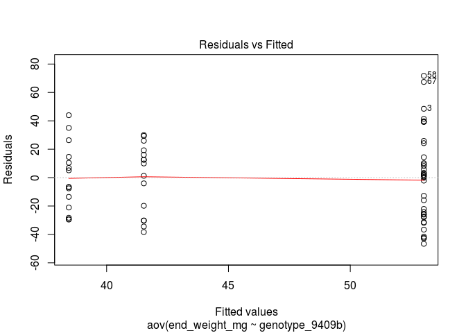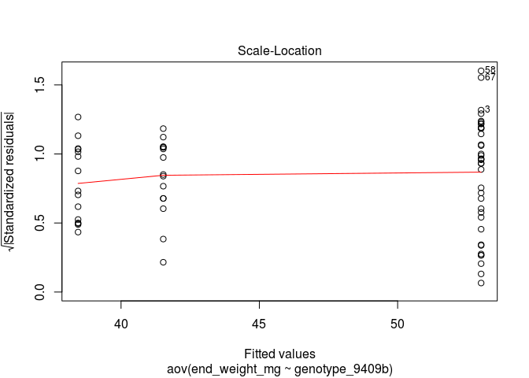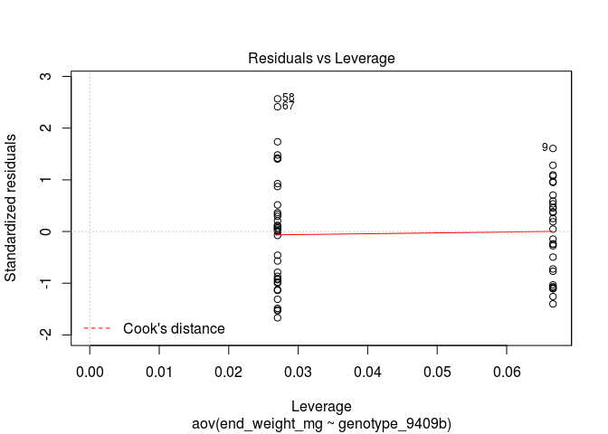

``` r
boxcox(fitDD, plotit = TRUE)
```

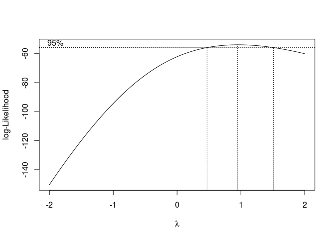

# A glm

Blocking on square because individuals within the same square got diet from the same syringe.

``` r
library(lme4)
fit_glmF <- lmer(sqrt(end_weight_mg) ~ 1 + genotype_9409b + (1|square), data = BV_CV98_03_BZF_I9_DD)
fit_glmR <- lmer(sqrt(end_weight_mg) ~ 1 + (1|square), data = BV_CV98_03_BZF_I9_DD)

summary(fit_glmF)
```

    ## Linear mixed model fit by REML ['lmerMod']
    ## Formula: sqrt(end_weight_mg) ~ 1 + genotype_9409b + (1 | square)
    ##    Data: BV_CV98_03_BZF_I9_DD
    ## 
    ## REML criterion at convergence: 291.5
    ## 
    ## Scaled residuals: 
    ##     Min      1Q  Median      3Q     Max 
    ## -1.9895 -0.7595  0.2044  0.6533  2.0182 
    ## 
    ## Random effects:
    ##  Groups   Name        Variance Std.Dev.
    ##  square   (Intercept) 0.129    0.3591  
    ##  Residual             4.754    2.1803  
    ## Number of obs: 67, groups:  square, 4
    ## 
    ## Fixed effects:
    ##                  Estimate Std. Error t value
    ## (Intercept)        5.8672     0.5918   9.914
    ## genotype_9409bAG   1.0659     0.6688   1.594
    ## genotype_9409bGG   0.1723     0.7976   0.216
    ## 
    ## Correlation of Fixed Effects:
    ##             (Intr) g_9409A
    ## gnty_9409AG -0.804        
    ## gnty_9409GG -0.673  0.597

``` r
anova(fit_glmR, fit_glmF)
```

    ## refitting model(s) with ML (instead of REML)

    ## Data: BV_CV98_03_BZF_I9_DD
    ## Models:
    ## fit_glmR: sqrt(end_weight_mg) ~ 1 + (1 | square)
    ## fit_glmF: sqrt(end_weight_mg) ~ 1 + genotype_9409b + (1 | square)
    ##          Df    AIC    BIC  logLik deviance  Chisq Chi Df Pr(>Chisq)
    ## fit_glmR  3 302.12 308.73 -148.06   296.12                         
    ## fit_glmF  5 302.89 313.92 -146.45   292.89 3.2245      2     0.1994

``` r
#forcing full model effects without the slope.
fit_glmF2 <- lmer(sqrt(end_weight_mg) ~ 0 + genotype_9409b + (1|square), data = BV_CV98_03_BZF_I9_DD)
summary(fit_glmF2)
```

    ## Linear mixed model fit by REML ['lmerMod']
    ## Formula: sqrt(end_weight_mg) ~ 0 + genotype_9409b + (1 | square)
    ##    Data: BV_CV98_03_BZF_I9_DD
    ## 
    ## REML criterion at convergence: 291.5
    ## 
    ## Scaled residuals: 
    ##     Min      1Q  Median      3Q     Max 
    ## -1.9895 -0.7595  0.2044  0.6533  2.0182 
    ## 
    ## Random effects:
    ##  Groups   Name        Variance Std.Dev.
    ##  square   (Intercept) 0.129    0.3591  
    ##  Residual             4.754    2.1803  
    ## Number of obs: 67, groups:  square, 4
    ## 
    ## Fixed effects:
    ##                  Estimate Std. Error t value
    ## genotype_9409bAA   5.8672     0.5918   9.914
    ## genotype_9409bAG   6.9330     0.4013  17.277
    ## genotype_9409bGG   6.0394     0.5925  10.193
    ## 
    ## Correlation of Fixed Effects:
    ##             g_9409AA g_9409AG
    ## gnty_9409AG 0.135            
    ## gnty_9409GG 0.093    0.137

## Excluding small individuals. Some progeny were still alive but with failure to thrive phenotypes.

``` r
BV_CV98_03_BZF_I9_DD_20 <- BV_CV98_03_BZF_I9_DD %>%
  filter (end_weight_mg > 20)

summary(aov(sqrt(end_weight_mg) ~ genotype_9409b, data = BV_CV98_03_BZF_I9_DD_20))
```

    ##                Df Sum Sq Mean Sq F value Pr(>F)
    ## genotype_9409b  2   3.74   1.870   0.699  0.502
    ## Residuals      51 136.36   2.674

``` r
BV_CV98_03_BZF_I9_DD_25 <- BV_CV98_03_BZF_I9_DD %>%
  filter (end_weight_mg > 25)

summary(aov(sqrt(end_weight_mg) ~ genotype_9409b, data = BV_CV98_03_BZF_I9_DD_25))
```

    ##                Df Sum Sq Mean Sq F value Pr(>F)
    ## genotype_9409b  2   3.45   1.724   0.753  0.477
    ## Residuals      47 107.64   2.290

``` r
BV_CV98_03_BZF_I9_DD_30 <- BV_CV98_03_BZF_I9_DD %>%
  filter (end_weight_mg > 30)

summary(aov(sqrt(end_weight_mg) ~ genotype_9409b, data = BV_CV98_03_BZF_I9_DD_30))
```

    ##                Df Sum Sq Mean Sq F value Pr(>F)  
    ## genotype_9409b  2  10.95   5.475   3.307 0.0464 *
    ## Residuals      42  69.54   1.656                 
    ## ---
    ## Signif. codes:  0 '***' 0.001 '**' 0.01 '*' 0.05 '.' 0.1 ' ' 1

``` r
BV_CV98_03_BZF_I9_DD_35 <- BV_CV98_03_BZF_I9_DD %>%
  filter (end_weight_mg > 35)

summary(aov(sqrt(end_weight_mg) ~ genotype_9409b, data = BV_CV98_03_BZF_I9_DD_35))
```

    ##                Df Sum Sq Mean Sq F value Pr(>F)
    ## genotype_9409b  2   5.74   2.871   2.024  0.146
    ## Residuals      38  53.90   1.419

``` r
BV_CV98_03_BZF_I9_DD_40 <- BV_CV98_03_BZF_I9_DD %>%
  filter (end_weight_mg > 40)

summary(aov(sqrt(end_weight_mg) ~ genotype_9409b, data = BV_CV98_03_BZF_I9_DD_40))
```

    ##                Df Sum Sq Mean Sq F value Pr(>F)
    ## genotype_9409b  2   5.50   2.752   2.122  0.134
    ## Residuals      36  46.67   1.296
