Linkage analysis for H.zea CHR13 marker with larval growth
================
Katherine Taylor and Megan Fritz
written Jan. 8, 2021

## Parental strains used for linkage analysis

Summary statistics and distributions of 7 day larval weights for the strains used as grandparents for linkage analysis crosses. A population acquired from Benzon Laboratories was used as the susceptible strain (dark grey) and a field-collected population from MD was used as the resistant strain (light grey). Panel A shows the distributions of weights on a diagnostic dose of a diet containing BC0805 (Cry1Ab) leaf tissue. Panel B shows the distributions of weights on Obsession II (Cry1A.105+Cry2Ab2) leaf tissue.

``` r
F0_growth %>% 
   filter(end_weight_mg != "") %>% 
   group_by(diet_strain, field) %>%
   summarize(
     count = n(),
     mean = mean(end_weight_mg),
     median = median(end_weight_mg),
     sd = sd(end_weight_mg)
   )
```

    ## # A tibble: 4 x 6
    ## # Groups:   diet_strain [2]
    ##   diet_strain field  count   mean median    sd
    ##   <fct>       <chr>  <int>  <dbl>  <dbl> <dbl>
    ## 1 O           Benzon   102   6.46    5.1  5.30
    ## 2 O           Field    147  86.9    78.1 38.5 
    ## 3 P           Benzon   101  19.9    15.3 13.2 
    ## 4 P           Field    148 115.    114.  38.2

``` r
#parents on BC0805
panelA <- F0_growth %>%
   filter(diet_strain == "P", end_weight_mg != "") %>%
   ggplot(aes(x = end_weight_mg, fill = field)) +
   geom_histogram(alpha = 0.5, position = "identity", bins = 20, color="black") +
   labs(x = "Weight (mg)", y = "Count", tag = "A") +
   theme_bw() + theme(panel.grid.major = element_blank(), panel.grid.minor = element_blank(), panel.background = element_blank()) +
   scale_fill_manual(name="field",
                          breaks = c("Benzon", "Field"),
                           labels = c("Susceptible", "MD"),
                          values = c("grey20", "grey80")) +
   scale_y_continuous(limits = c(0, 55), breaks = c(0, 20, 40, 60)) +
   theme(axis.text=element_text(size=12),
         axis.title=element_text(size=14,face="bold"))+
   theme(legend.position = "none") 

panelA
```


``` r
#Parents on ObsII
panelB <- F0_growth %>%
   filter(diet_strain == "O", end_weight_mg != "") %>%
   ggplot(aes(x = end_weight_mg, fill = field)) +
    geom_histogram(alpha = 0.5, position = "identity", bins = 20, color="black") +
   labs(x = "Weight (mg)", y = "Count", tag = "B") +
   theme_bw() + theme(panel.grid.major = element_blank(), panel.grid.minor = element_blank(), panel.background = element_blank()) +
   scale_fill_manual(name = "Population",
                          breaks = c("Benzon", "Field"),
                           labels = c("Susceptible", "MD"),
                          values = c("grey20", "grey80"))  +
   scale_y_continuous(limits = c(0, 55), breaks = c(0, 20, 40, 60)) + theme(legend.position = "none") +
   theme(axis.text=element_text(size=12),
         axis.title=element_text(size=14,face="bold")) 
 
panelB
```


## Testing for differences in final weight between the parental strains

``` r
#subsetting the data by diet treatment
F0_BC0805 <- subset(F0_growth, diet_strain == "P")
F0_ObsII <- subset(F0_growth, diet_strain == "O")


#BC0805 treatment first.
fitF0_P <- aov(end_weight_mg ~ field, data = F0_BC0805)
summary(fitF0_P)#shows statistically significant differences in 7 day weights for Benzon and MD pops on BC0805 diet.
```

    ##              Df Sum Sq Mean Sq F value Pr(>F)    
    ## field         1 538020  538020   572.7 <2e-16 ***
    ## Residuals   247 232045     939                   
    ## ---
    ## Signif. codes:  0 '***' 0.001 '**' 0.01 '*' 0.05 '.' 0.1 ' ' 1
    ## 2 observations deleted due to missingness

``` r
shapiro.test(resid(fitF0_P))#BC0805 dataset meets assumptions of normality, but barely.
```

    ## 
    ##  Shapiro-Wilk normality test
    ## 
    ## data:  resid(fitF0_P)
    ## W = 0.9897, p-value = 0.07405

``` r
#fitting a glm
fitF0_P1 <- glm(end_weight_mg ~ 1 + field, data = F0_BC0805, family = "gaussian")
summary(fitF0_P1)
```

    ## 
    ## Call:
    ## glm(formula = end_weight_mg ~ 1 + field, family = "gaussian", 
    ##     data = F0_BC0805)
    ## 
    ## Deviance Residuals: 
    ##     Min       1Q   Median       3Q      Max  
    ## -93.767  -16.098   -2.967   18.533   97.533  
    ## 
    ## Coefficients:
    ##             Estimate Std. Error t value Pr(>|t|)    
    ## (Intercept)   19.898      3.050   6.524 3.84e-10 ***
    ## fieldField    94.669      3.956  23.931  < 2e-16 ***
    ## ---
    ## Signif. codes:  0 '***' 0.001 '**' 0.01 '*' 0.05 '.' 0.1 ' ' 1
    ## 
    ## (Dispersion parameter for gaussian family taken to be 939.4549)
    ## 
    ##     Null deviance: 770065  on 248  degrees of freedom
    ## Residual deviance: 232045  on 247  degrees of freedom
    ##   (2 observations deleted due to missingness)
    ## AIC: 2415.1
    ## 
    ## Number of Fisher Scoring iterations: 2

``` r
fitF0_P2 <- glm(end_weight_mg ~ 1 + field, data = F0_BC0805, family = "Gamma")
summary(fitF0_P2)#this is the better fit according to AIC
```

    ## 
    ## Call:
    ## glm(formula = end_weight_mg ~ 1 + field, family = "Gamma", data = F0_BC0805)
    ## 
    ## Deviance Residuals: 
    ##     Min       1Q   Median       3Q      Max  
    ## -1.8572  -0.3830  -0.0476   0.2601   1.4262  
    ## 
    ## Coefficients:
    ##              Estimate Std. Error t value Pr(>|t|)    
    ## (Intercept)  0.050256   0.002471   20.34   <2e-16 ***
    ## fieldField  -0.041528   0.002496  -16.64   <2e-16 ***
    ## ---
    ## Signif. codes:  0 '***' 0.001 '**' 0.01 '*' 0.05 '.' 0.1 ' ' 1
    ## 
    ## (Dispersion parameter for Gamma family taken to be 0.2441351)
    ## 
    ##     Null deviance: 218.37  on 248  degrees of freedom
    ## Residual deviance:  68.06  on 247  degrees of freedom
    ##   (2 observations deleted due to missingness)
    ## AIC: 2340.4
    ## 
    ## Number of Fisher Scoring iterations: 5

``` r
#looking at distributions again
plot(fitF0_P1)
```


``` r
plot(fitF0_P2)#this does look better....
```


``` r
#model comparison with and without field.
fitF0_P2red <- glm(end_weight_mg ~ 1, data = F0_BC0805, family = "Gamma")

lrtest(fitF0_P2red,fitF0_P2)#statistically sig diff again
```

    ## Likelihood ratio test
    ## 
    ## Model 1: end_weight_mg ~ 1
    ## Model 2: end_weight_mg ~ 1 + field
    ##   #Df  LogLik Df  Chisq Pr(>Chisq)    
    ## 1   2 -1324.5                         
    ## 2   3 -1167.2  1 314.57  < 2.2e-16 ***
    ## ---
    ## Signif. codes:  0 '***' 0.001 '**' 0.01 '*' 0.05 '.' 0.1 ' ' 1

``` r
#ObsII treatment second
fitF0_O <- aov(end_weight_mg ~ field, data = F0_ObsII)
summary(fitF0_O) #statistically significant differences between Benzon and MD parents on ObsII diet.
```

    ##              Df Sum Sq Mean Sq F value Pr(>F)    
    ## field         1 389935  389935     440 <2e-16 ***
    ## Residuals   247 218896     886                   
    ## ---
    ## Signif. codes:  0 '***' 0.001 '**' 0.01 '*' 0.05 '.' 0.1 ' ' 1

``` r
shapiro.test(resid(fitF0_O))#ObsII does not meet assumptions of normality.
```

    ## 
    ##  Shapiro-Wilk normality test
    ## 
    ## data:  resid(fitF0_O)
    ## W = 0.93289, p-value = 3.22e-09

``` r
#trying a log10 transformation first
fitF0_OL <- aov(log10(end_weight_mg) ~ field, data = F0_ObsII)
summary(fitF0_OL)
```

    ##              Df Sum Sq Mean Sq F value Pr(>F)    
    ## field         1  86.34   86.34    1188 <2e-16 ***
    ## Residuals   247  17.95    0.07                   
    ## ---
    ## Signif. codes:  0 '***' 0.001 '**' 0.01 '*' 0.05 '.' 0.1 ' ' 1

``` r
shapiro.test(resid(fitF0_OL))#helps alot, but still does not meet assumptions of normality
```

    ## 
    ##  Shapiro-Wilk normality test
    ## 
    ## data:  resid(fitF0_OL)
    ## W = 0.98083, p-value = 0.001924

``` r
#fitting a glm
fitF0_O1 <- glm(end_weight_mg ~ 1 + field, data = F0_ObsII, family = "gaussian")
summary(fitF0_O1)
```

    ## 
    ## Call:
    ## glm(formula = end_weight_mg ~ 1 + field, family = "gaussian", 
    ##     data = F0_ObsII)
    ## 
    ## Deviance Residuals: 
    ##     Min       1Q   Median       3Q      Max  
    ## -77.034  -17.734   -2.264    7.166  107.266  
    ## 
    ## Coefficients:
    ##             Estimate Std. Error t value Pr(>|t|)    
    ## (Intercept)    6.464      2.948   2.193   0.0292 *  
    ## fieldField    80.471      3.836  20.976   <2e-16 ***
    ## ---
    ## Signif. codes:  0 '***' 0.001 '**' 0.01 '*' 0.05 '.' 0.1 ' ' 1
    ## 
    ## (Dispersion parameter for gaussian family taken to be 886.2194)
    ## 
    ##     Null deviance: 608831  on 248  degrees of freedom
    ## Residual deviance: 218896  on 247  degrees of freedom
    ## AIC: 2400.6
    ## 
    ## Number of Fisher Scoring iterations: 2

``` r
fitF0_O2 <- glm(end_weight_mg ~ 1 + field, data = F0_ObsII, family = "Gamma")
summary(fitF0_O2)#this is the better fit according to AIC
```

    ## 
    ## Call:
    ## glm(formula = end_weight_mg ~ 1 + field, family = "Gamma", data = F0_ObsII)
    ## 
    ## Deviance Residuals: 
    ##     Min       1Q   Median       3Q      Max  
    ## -1.6041  -0.4540  -0.1569   0.2915   2.4930  
    ## 
    ## Coefficients:
    ##              Estimate Std. Error t value Pr(>|t|)    
    ## (Intercept)  0.154710   0.009573   16.16   <2e-16 ***
    ## fieldField  -0.143207   0.009591  -14.93   <2e-16 ***
    ## ---
    ## Signif. codes:  0 '***' 0.001 '**' 0.01 '*' 0.05 '.' 0.1 ' ' 1
    ## 
    ## (Dispersion parameter for Gamma family taken to be 0.3905234)
    ## 
    ##     Null deviance: 380.882  on 248  degrees of freedom
    ## Residual deviance:  88.101  on 247  degrees of freedom
    ## AIC: 2073.9
    ## 
    ## Number of Fisher Scoring iterations: 6

``` r
#qq comparison of distributions.
plot(fitF0_O1)
```


``` r
plot(fitF0_O2)#again, looks better....
```


``` r
#model comparison with and without field.
fitF0_O2red <- glm(end_weight_mg ~ 1, data = F0_ObsII, family = "Gamma")

lrtest(fitF0_O2red,fitF0_O2)#statistically sig diff here too
```

    ## Likelihood ratio test
    ## 
    ## Model 1: end_weight_mg ~ 1
    ## Model 2: end_weight_mg ~ 1 + field
    ##   #Df  LogLik Df  Chisq Pr(>Chisq)    
    ## 1   2 -1238.9                         
    ## 2   3 -1034.0  1 409.97  < 2.2e-16 ***
    ## ---
    ## Signif. codes:  0 '***' 0.001 '**' 0.01 '*' 0.05 '.' 0.1 ' ' 1

## First mapping family - untreated vs. Cry1Ab leaf tissue incorporation assay

One F2 mapping family was generated and split into two groups at 48h after hatching - half were placed on diet with untreated leaf tissue (orange), the other half were placed on diet containing Cry1Ab treated leaf tissue (blue). A second F2 mapping family was generated and also split into two groups at 48h after hatching - half were placed on diet containing Cry1A.105 + Cry2Ab2 treated leaf tissue (purple). While we put the other half of the family on diet with untreated leaf tissue from a sweet corn isoline with the same genetic background as the two-toxin treated tissue, the data are not shown for simplicity. All larvae were allowed to feed for 7 days and then weighed.

We genotyped all progeny at two loci in the 3Mb region - are they correlated?

``` r
joined$num9409b <- as.numeric(gsub("GG", 0, gsub("AG", 1, gsub("AA", 2, joined$genotype_9409b))))
joined$num3749 <- as.numeric(gsub("CC", 0, gsub("CT", 1, gsub("TT", 2, joined$genotype_3749))))

cor.test(joined$num9409b, joined$num3749, method = "kendall")#significant correlation between these two loci
```

    ## 
    ##  Kendall's rank correlation tau
    ## 
    ## data:  joined$num9409b and joined$num3749
    ## z = 12.115, p-value < 2.2e-16
    ## alternative hypothesis: true tau is not equal to 0
    ## sample estimates:
    ##       tau 
    ## 0.9892009

Due to the significant correlation between genotypes at the two loci, just looking at cpq1 going forward.

``` r
#good plot for presentation - 9409_b; AA is derived
joined %>%
  filter (genotype_9409b != "") %>%
ggplot(aes(x = genotype_9409b, y = end_weight_mg, fill = TreatByFam, color = TreatByFam)) +
  geom_boxplot(fatten = 1, alpha = 0.8, notch = F) +
  geom_point(position=position_jitterdodge(jitter.width = 0.3)) +
  labs(y = "Weight (mg)", x = "") +
  theme_bw() + theme(panel.grid.major = element_blank(), panel.grid.minor = element_blank(), panel.background = element_blank()) +
  scale_y_continuous(breaks = c(0, 100, 200, 300)) +
  ylim(0,350) +
  scale_x_discrete(breaks  = c("GG", "AG", "AA"),
                   labels = c("A", "A/V", "V")) +
  scale_fill_manual(name="Treatment By Family",
                         breaks=c("Fam 1 CL", "Fam 1 DD", "Fam 2 DD"),
                         values=c("#E69F00", "#56B4E9", "#9932CC")) +
  scale_color_manual(name="Treatment By Family ",
                         breaks=c("Fam 1 CL", "Fam 1 DD", "Fam 2 DD"),
                         values=c("#E69F00", "#56B4E9", "#9932CC")) +
  theme(axis.text=element_text(size=12),
         axis.title=element_text(size=14,face="bold"))
```

    ## Scale for 'y' is already present. Adding another scale for 'y', which will
    ## replace the existing scale.


``` r
#individual plots by family/treat
BV_BA52_BZM_P11_A1_CL %>%
ggplot(aes(x = genotype_9409b, y = end_weight_mg)) +
  geom_boxplot(fatten = 1, fill='#A4A4A4', color="black") + geom_jitter(position=position_jitter(0.2)) +
  theme_bw() + theme(panel.grid.major = element_blank(), panel.grid.minor = element_blank(), panel.background = element_blank()) +
  labs(y = "Weight (mg)", x = "", tag = "C") +
  scale_y_continuous(limits = c(0,400), breaks = c(0, 50, 100, 150, 200, 250, 300, 350)) +
  scale_x_discrete(breaks  = c("GG", "AG", "AA"), labels = c("A", "A/V", "V")) +
  theme(axis.text=element_text(size=14), 
        axis.title=element_text(size=16,face="bold"))
```


``` r
BV_BA52_BZM_P11_A1_DD %>%
ggplot(aes(x = genotype_9409b, y = end_weight_mg)) +
  geom_boxplot(fatten = 1, fill='#A4A4A4', color="black") + geom_jitter(position=position_jitter(0.2)) +
  theme_bw() + theme(panel.grid.major = element_blank(), panel.grid.minor = element_blank(), panel.background = element_blank()) +
  labs(y = "Weight (mg)", x = "", tag = "D") +
  scale_y_continuous(limits = c(0,350), breaks = c(0, 50, 100, 150, 200, 250, 300, 350)) +
  scale_x_discrete(breaks  = c("GG", "AG", "AA"),
                   labels = c("A", "A/V", "V")) +
  theme(axis.text=element_text(size=14),
         axis.title=element_text(size=16,face="bold"))
```


``` r
BV_CV98_03_BZF_I9_DD %>%
ggplot(aes(x = genotype_9409b, y = end_weight_mg)) +
  geom_boxplot(fatten = 1, fill='#A4A4A4', color="black") + geom_jitter(position=position_jitter(0.2)) +
  theme_bw() + theme(panel.grid.major = element_blank(), panel.grid.minor = element_blank(), panel.background = element_blank()) +
  labs(y = "Weight (mg)", x = "", tag = "E") +
  scale_y_continuous(limits = c(0,350), breaks = c(0, 50, 100, 150, 200, 250, 300,350)) +
  scale_x_discrete(breaks  = c("GG", "AG", "AA"),
                   labels = c("A", "A/V", "V")) +
 theme(axis.text=element_text(size=14),
         axis.title=element_text(size=16,face="bold"))
```


## Counts of larvae with each genotype & test for mendelian seg

``` r
exp_props <- c(0.25, 0.5, 0.25)

geno9409_dist_BCO805_DD <- as.matrix(table(BV_BA52_BZM_P11_A1_DD$genotype_9409b))#allele freqs diag dose BC0805
print(geno9409_dist_BCO805_DD[-1,])#AA is the derived genotype in the field
```

    ## AA AG GG 
    ## 15 33 10

``` r
chisq.test(x = geno9409_dist_BCO805_DD[-1,], p = exp_props, simulate.p.value = T)
```

    ## 
    ##  Chi-squared test for given probabilities with simulated p-value (based
    ##  on 2000 replicates)
    ## 
    ## data:  geno9409_dist_BCO805_DD[-1, ]
    ## X-squared = 1.9655, df = NA, p-value = 0.3983

``` r
geno9409_dist_BCO805_CL <- as.matrix(table(BV_BA52_BZM_P11_A1_CL$genotype_9409b))#allele freqs control diet
print(geno9409_dist_BCO805_CL[-1,])#AA is the derived genotype in the field
```

    ## AA AG GG 
    ## 17 20 13

``` r
chisq.test(x = geno9409_dist_BCO805_CL[-1,], p = exp_props, simulate.p.value = T)
```

    ## 
    ##  Chi-squared test for given probabilities with simulated p-value (based
    ##  on 2000 replicates)
    ## 
    ## data:  geno9409_dist_BCO805_CL[-1, ]
    ## X-squared = 2.64, df = NA, p-value = 0.2894

``` r
geno9409_dist_Obs_DD <- as.matrix(table(BV_CV98_03_BZF_I9_DD $genotype_9409b))#allele freqs control diet
print(geno9409_dist_Obs_DD)#AA is the derived genotype in the field
```

    ##    [,1]
    ## AA   15
    ## AG   37
    ## GG   15

``` r
chisq.test(x = geno9409_dist_Obs_DD, p = exp_props, simulate.p.value = T)
```

    ## 
    ##  Chi-squared test for given probabilities with simulated p-value (based
    ##  on 2000 replicates)
    ## 
    ## data:  geno9409_dist_Obs_DD
    ## X-squared = 0.73134, df = NA, p-value = 0.7061

## Anova and data transformation

We check the assumptions with plots and a shapiro test. If not normally distributed, checking residuals and trying different transformations, as well as glms with different assumptions for distribution of residuals.

Progeny on treated diet

``` r
fitDD <- aov(end_weight_mg ~ genotype_9409b, data = BV_BA52_BZM_P11_A1_DD)
summary(fitDD)
```

    ##                Df Sum Sq Mean Sq F value Pr(>F)
    ## genotype_9409b  2   5548    2774   2.132  0.128
    ## Residuals      55  71565    1301

``` r
shapiro.test(resid(fitDD))
```

    ## 
    ##  Shapiro-Wilk normality test
    ## 
    ## data:  resid(fitDD)
    ## W = 0.95279, p-value = 0.02448

``` r
plot(fitDD)#a heavy-tailed distribution
```


Then tried a parametric tests with transformed responses.

``` r
fit_BV_BA52_BZM_P11_A1_DD1 <- aov(sqrt(end_weight_mg) ~ genotype_9409b, data = BV_BA52_BZM_P11_A1_DD)
summary(fit_BV_BA52_BZM_P11_A1_DD1)
```

    ##                Df Sum Sq Mean Sq F value Pr(>F)
    ## genotype_9409b  2  18.79   9.394   2.313  0.108
    ## Residuals      55 223.36   4.061

``` r
plot(fit_BV_BA52_BZM_P11_A1_DD1)
```


``` r
fit_BV_BA52_BZM_P11_A1_DD2 <- aov(log(end_weight_mg) ~ genotype_9409b, data = BV_BA52_BZM_P11_A1_DD)
summary(fit_BV_BA52_BZM_P11_A1_DD2)
```

    ##                Df Sum Sq Mean Sq F value Pr(>F)  
    ## genotype_9409b  2  1.146  0.5729   2.498 0.0915 .
    ## Residuals      55 12.611  0.2293                 
    ## ---
    ## Signif. codes:  0 '***' 0.001 '**' 0.01 '*' 0.05 '.' 0.1 ' ' 1

``` r
plot(fit_BV_BA52_BZM_P11_A1_DD2)
```


``` r
fit_BV_BA52_BZM_P11_A1_DD3 <- aov((end_weight_mg^2) ~ genotype_9409b, data = BV_BA52_BZM_P11_A1_DD)
summary(fit_BV_BA52_BZM_P11_A1_DD3)
```

    ##                Df    Sum Sq  Mean Sq F value Pr(>F)
    ## genotype_9409b  2 1.644e+08 82176345   1.874  0.163
    ## Residuals      55 2.411e+09 43845229

``` r
plot(fit_BV_BA52_BZM_P11_A1_DD3)
```


``` r
#log transformation looks to be the best fit
```

Parametric test for individuals raised up on untreated diet.

``` r
fit_BV_BA52_BZM_P11_A1_CL <- aov(end_weight_mg ~ genotype_9409b, data = BV_BA52_BZM_P11_A1_CL)
summary(fit_BV_BA52_BZM_P11_A1_CL)
```

    ##                Df Sum Sq Mean Sq F value Pr(>F)
    ## genotype_9409b  2  19012    9506   1.994  0.148
    ## Residuals      47 224092    4768

``` r
shapiro.test(resid(fit_BV_BA52_BZM_P11_A1_CL))#shows no transformation needed.
```

    ## 
    ##  Shapiro-Wilk normality test
    ## 
    ## data:  resid(fit_BV_BA52_BZM_P11_A1_CL)
    ## W = 0.96659, p-value = 0.1676

``` r
plot(fit_BV_BA52_BZM_P11_A1_CL)
```


# Adding a random effect of square = 1 syringe mixture does one square.

``` r
#not putting this section in the markdown file because it didn't change anything.
fit_glmF <- lmer(log(end_weight_mg) ~ 1 + genotype_9409b + (1|square), data = BV_BA52_BZM_P11_A1_DD)
fit_glmR <- lmer(log(end_weight_mg) ~ 1 + (1|square),  data = BV_BA52_BZM_P11_A1_DD)

summary(fit_glmF)
```

    ## Linear mixed model fit by REML ['lmerMod']
    ## Formula: log(end_weight_mg) ~ 1 + genotype_9409b + (1 | square)
    ##    Data: BV_BA52_BZM_P11_A1_DD
    ## 
    ## REML criterion at convergence: 83
    ## 
    ## Scaled residuals: 
    ##      Min       1Q   Median       3Q      Max 
    ## -2.42237 -0.59725 -0.04518  0.83459  1.70042 
    ## 
    ## Random effects:
    ##  Groups   Name        Variance Std.Dev.
    ##  square   (Intercept) 0.01454  0.1206  
    ##  Residual             0.21668  0.4655  
    ## Number of obs: 58, groups:  square, 7
    ## 
    ## Fixed effects:
    ##                  Estimate Std. Error t value
    ## (Intercept)       4.20991    0.12967  32.465
    ## genotype_9409bAG  0.22013    0.14692   1.498
    ## genotype_9409bGG -0.06838    0.19314  -0.354
    ## 
    ## Correlation of Fixed Effects:
    ##             (Intr) g_9409A
    ## gnty_9409AG -0.777        
    ## gnty_9409GG -0.587  0.510

``` r
lrtest(fit_glmR, fit_glmF)#adding the blocking factor doesn't change much.
```

    ## Likelihood ratio test
    ## 
    ## Model 1: log(end_weight_mg) ~ 1 + (1 | square)
    ## Model 2: log(end_weight_mg) ~ 1 + genotype_9409b + (1 | square)
    ##   #Df  LogLik Df  Chisq Pr(>Chisq)
    ## 1   3 -41.465                     
    ## 2   5 -41.521  2 0.1121     0.9455

``` r
#checking end weights by square
boxplot(BV_BA52_BZM_P11_A1_DD$end_weight_mg ~ BV_BA52_BZM_P11_A1_DD$square)
```


``` r
#now for the controls
fit_glmF <- lmer(end_weight_mg ~ 1 + genotype_9409b + (1|square), data = BV_BA52_BZM_P11_A1_CL)
fit_glmR <- lmer(end_weight_mg ~ 1 + (1|square), data = BV_BA52_BZM_P11_A1_CL)

summary(fit_glmF)
```

    ## Linear mixed model fit by REML ['lmerMod']
    ## Formula: end_weight_mg ~ 1 + genotype_9409b + (1 | square)
    ##    Data: BV_BA52_BZM_P11_A1_CL
    ## 
    ## REML criterion at convergence: 531
    ## 
    ## Scaled residuals: 
    ##      Min       1Q   Median       3Q      Max 
    ## -2.61202 -0.44432  0.07069  0.36508  1.65767 
    ## 
    ## Random effects:
    ##  Groups   Name        Variance Std.Dev.
    ##  square   (Intercept) 1727     41.56   
    ##  Residual             3280     57.28   
    ## Number of obs: 50, groups:  square, 7
    ## 
    ## Fixed effects:
    ##                  Estimate Std. Error t value
    ## (Intercept)        235.99      21.81  10.821
    ## genotype_9409bAG   -42.57      19.60  -2.171
    ## genotype_9409bGG   -64.48      23.05  -2.797
    ## 
    ## Correlation of Fixed Effects:
    ##             (Intr) g_9409A
    ## gnty_9409AG -0.490        
    ## gnty_9409GG -0.484  0.471

``` r
lrtest(fit_glmR, fit_glmF)#but the controls look like there may be statistically significant differences in growth.
```

    ## Likelihood ratio test
    ## 
    ## Model 1: end_weight_mg ~ 1 + (1 | square)
    ## Model 2: end_weight_mg ~ 1 + genotype_9409b + (1 | square)
    ##   #Df  LogLik Df  Chisq Pr(>Chisq)    
    ## 1   3 -277.33                         
    ## 2   5 -265.51  2 23.638  7.363e-06 ***
    ## ---
    ## Signif. codes:  0 '***' 0.001 '**' 0.01 '*' 0.05 '.' 0.1 ' ' 1

``` r
#Checking end weights by square
boxplot(BV_BA52_BZM_P11_A1_CL$end_weight_mg ~ BV_BA52_BZM_P11_A1_CL$square)
```


# Do the distributions of the genotype frequencies differ for high and low weight gain individuals, per Tabashnik comments?

``` r
#Cry1Ab DD
quant_33 <- quantile(BV_BA52_BZM_P11_A1_DD$end_weight_mg, probs = c(0.33, 0.66))#also tried (0.25, 0.75) with no difference.
BV_BA52_BZM_P11_A1_DD_LO <- subset(BV_BA52_BZM_P11_A1_DD, end_weight_mg < quant_33[1]) 
geno9409_dist_BCO805_DDLO <- as.matrix(table(BV_BA52_BZM_P11_A1_DD_LO$genotype_9409b))
geno9409_dist_BCO805_DDLO
```

    ##    [,1]
    ##       0
    ## AA    6
    ## AG    7
    ## GG    6

``` r
BV_BA52_BZM_P11_A1_DD_HI <- subset(BV_BA52_BZM_P11_A1_DD, end_weight_mg > quant_33[2])
geno9409_dist_BCO805_DDHI <- as.matrix(table(BV_BA52_BZM_P11_A1_DD_HI$genotype_9409b))
geno9409_dist_BCO805_DDHI
```

    ##    [,1]
    ##       0
    ## AA    4
    ## AG   13
    ## GG    3

``` r
fisher.test(data.frame(cbind(geno9409_dist_BCO805_DDLO[-1],geno9409_dist_BCO805_DDHI[-1,])))
```

    ## 
    ##  Fisher's Exact Test for Count Data
    ## 
    ## data:  
    ## p-value = 0.2328
    ## alternative hypothesis: two.sided

``` r
#Control 
quant_33 <- quantile(BV_BA52_BZM_P11_A1_CL$end_weight_mg, probs = c(0.33, 0.66))#changing quantiles to (0.25, 0.75) makes it not significant

BV_BA52_BZM_P11_A1_CL_LO <- subset(BV_BA52_BZM_P11_A1_CL, end_weight_mg < quant_33[1])
geno9409_dist_BCO805_CLLO <- as.matrix(table(BV_BA52_BZM_P11_A1_CL_LO$genotype_9409b))
geno9409_dist_BCO805_CLLO
```

    ##    [,1]
    ##       0
    ## AA    2
    ## AG    9
    ## GG    6

``` r
BV_BA52_BZM_P11_A1_CL_HI <- subset(BV_BA52_BZM_P11_A1_CL, end_weight_mg > quant_33[2])
geno9409_dist_BCO805_CLHI <- as.matrix(table(BV_BA52_BZM_P11_A1_CL_HI$genotype_9409b))
geno9409_dist_BCO805_CLHI
```

    ##    [,1]
    ##       0
    ## AA    8
    ## AG    5
    ## GG    4

``` r
fisher.test(data.frame(cbind(geno9409_dist_BCO805_CLLO[-1],geno9409_dist_BCO805_CLHI[-1,])))
```

    ## 
    ##  Fisher's Exact Test for Count Data
    ## 
    ## data:  
    ## p-value = 0.1097
    ## alternative hypothesis: two.sided

## Second Mapping family - Cry1A.105 + Cry2Ab2 leaf tissue incorporation assay

Statistical analysis for the half of the second family on treated diet.

## Anova and data transformations

``` r
fitDD <- aov(end_weight_mg ~ genotype_9409b, data = BV_CV98_03_BZF_I9_DD)
shapiro.test(resid(fitDD)) #suggests a transformation may not be needed.
```

    ## 
    ##  Shapiro-Wilk normality test
    ## 
    ## data:  resid(fitDD)
    ## W = 0.96808, p-value = 0.08258

``` r
plot(fitDD)
```

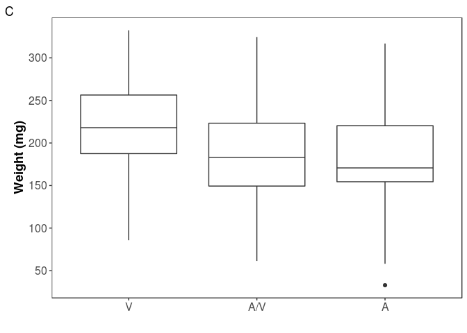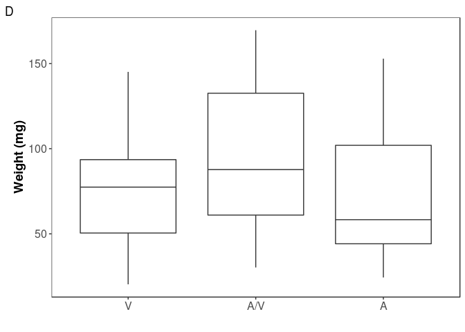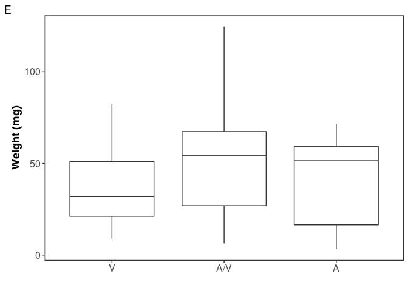

``` r
fitDD2 <- aov(sqrt(end_weight_mg) ~ genotype_9409b, data = BV_CV98_03_BZF_I9_DD)
shapiro.test(resid(fitDD2))
```

    ## 
    ##  Shapiro-Wilk normality test
    ## 
    ## data:  resid(fitDD2)
    ## W = 0.9688, p-value = 0.09041

``` r
plot(fitDD2)
```

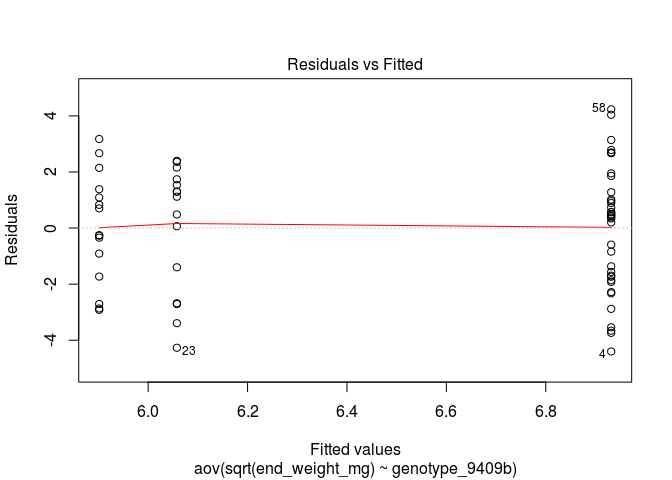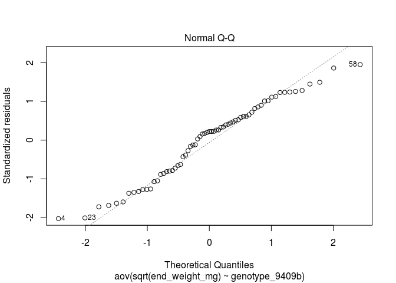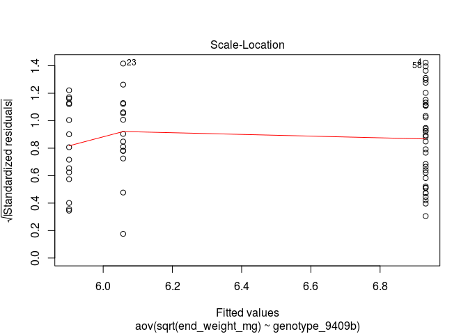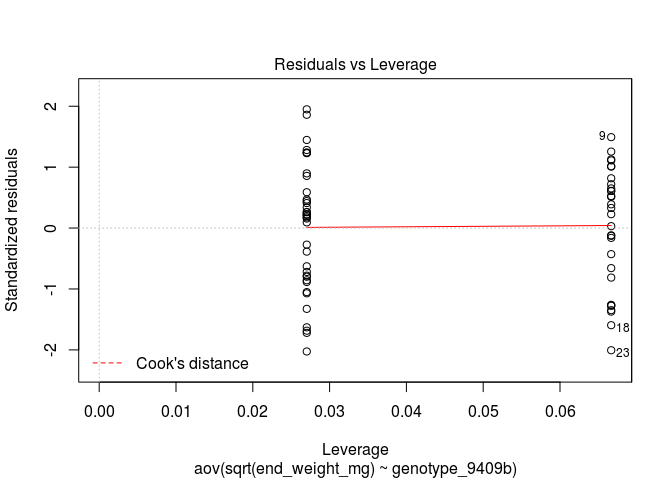

``` r
fitDD3 <- aov(log(end_weight_mg) ~ genotype_9409b, data = BV_CV98_03_BZF_I9_DD)
shapiro.test(resid(fitDD3))
```

    ## 
    ##  Shapiro-Wilk normality test
    ## 
    ## data:  resid(fitDD3)
    ## W = 0.91738, p-value = 0.0002792

``` r
plot(fitDD3)
```

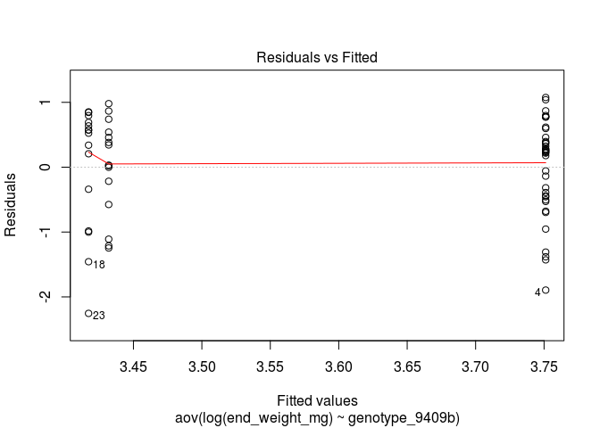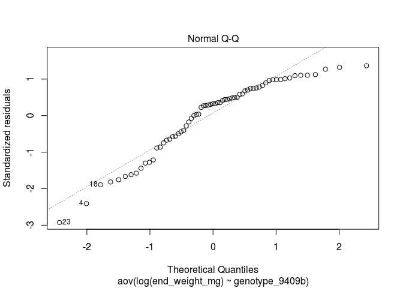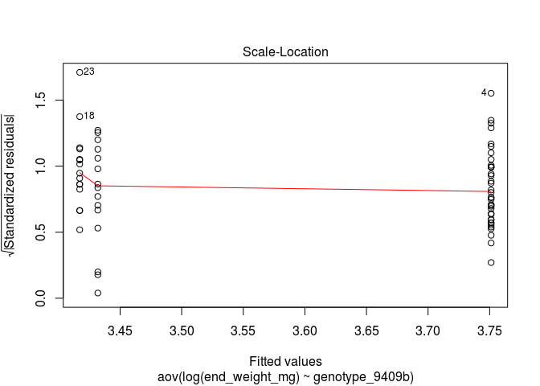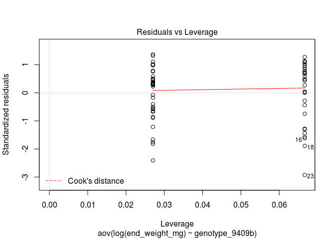

``` r
#untransformed data actually looks the best.
```

``` r
#tried a glm too so that I could test whether adding a random effect of square impacted the model output

fit_glmF <- lmer(end_weight_mg ~ 1 + genotype_9409b + (1|traySquare), data = BV_CV98_03_BZF_I9_DD)
fit_glmR <- lmer(end_weight_mg ~ 1 + (1|traySquare), data = BV_CV98_03_BZF_I9_DD)
```

    ## boundary (singular) fit: see ?isSingular

``` r
summary(fit_glmF)
```

    ## Linear mixed model fit by REML ['lmerMod']
    ## Formula: end_weight_mg ~ 1 + genotype_9409b + (1 | traySquare)
    ##    Data: BV_CV98_03_BZF_I9_DD
    ## 
    ## REML criterion at convergence: 618.6
    ## 
    ## Scaled residuals: 
    ##      Min       1Q   Median       3Q      Max 
    ## -1.65999 -0.89821  0.06085  0.53639  2.53748 
    ## 
    ## Random effects:
    ##  Groups     Name        Variance Std.Dev.
    ##  traySquare (Intercept)   4.913   2.217  
    ##  Residual               797.612  28.242  
    ## Number of obs: 67, groups:  traySquare, 8
    ## 
    ## Fixed effects:
    ##                  Estimate Std. Error t value
    ## (Intercept)        38.346      7.338   5.226
    ## genotype_9409bAG   14.669      8.655   1.695
    ## genotype_9409bGG    3.071     10.333   0.297
    ## 
    ## Correlation of Fixed Effects:
    ##             (Intr) g_9409A
    ## gnty_9409AG -0.839        
    ## gnty_9409GG -0.703  0.597

``` r
coef(fit_glmF)
```

    ## $traySquare
    ##      (Intercept) genotype_9409bAG genotype_9409bGG
    ## 1  A    38.61279         14.66863          3.07121
    ## 1  B    37.90399         14.66863          3.07121
    ## 1  C    37.65831         14.66863          3.07121
    ## 1  D    39.06390         14.66863          3.07121
    ## 3  A    37.89329         14.66863          3.07121
    ## 3  B    38.55319         14.66863          3.07121
    ## 3  C    38.36792         14.66863          3.07121
    ## 3  D    38.71851         14.66863          3.07121
    ## 
    ## attr(,"class")
    ## [1] "coef.mer"

``` r
lrtest(fit_glmR, fit_glmF)
```

    ## Likelihood ratio test
    ## 
    ## Model 1: end_weight_mg ~ 1 + (1 | traySquare)
    ## Model 2: end_weight_mg ~ 1 + genotype_9409b + (1 | traySquare)
    ##   #Df  LogLik Df  Chisq Pr(>Chisq)    
    ## 1   3 -317.22                         
    ## 2   5 -309.31  2 15.813  0.0003682 ***
    ## ---
    ## Signif. codes:  0 '***' 0.001 '**' 0.01 '*' 0.05 '.' 0.1 ' ' 1

``` r
#the significance is surprising so looking at boxplot 
boxplot(BV_CV98_03_BZF_I9_DD$end_weight_mg ~ BV_CV98_03_BZF_I9_DD$traySquare)
```


``` r
#was there a weird distribution of genotypes across squares? No.
table(BV_CV98_03_BZF_I9_DD$genotype_9409b, BV_CV98_03_BZF_I9_DD$traySquare)
```

    ##     
    ##      1  A 1  B 1  C 1  D 3  A 3  B 3  C 3  D
    ##   AA    2    1    1    2    2    2    2    3
    ##   AG    6    7    5    5    2    4    4    4
    ##   GG    3    3    1    4    1    2    1    0

# Dist of the genotype frequencies for high and low weight gain individuals, per Tabashnik comments

``` r
#Cry1A.105 + Cry2Ab2 DD
quant_33 <- quantile(BV_CV98_03_BZF_I9_DD$end_weight_mg, c(0.33, 0.66))#result does not differ if I change to (0.25, 0.75)
BV_CV98_03_BZF_I9_DD_LO <- subset(BV_CV98_03_BZF_I9_DD, end_weight_mg < quant_33[1])
geno9409_dist_ObsII_DDLO <- as.matrix(table(BV_CV98_03_BZF_I9_DD_LO$genotype_9409b))
geno9409_dist_ObsII_DDLO
```

    ##    [,1]
    ## AA    5
    ## AG   12
    ## GG    5

``` r
BV_CV98_03_BZF_I9_DD_HI <- subset(BV_CV98_03_BZF_I9_DD, end_weight_mg > quant_33[2])
geno9409_dist_ObsII_DDHI <- as.matrix(table(BV_CV98_03_BZF_I9_DD_HI$genotype_9409b))
geno9409_dist_ObsII_DDHI
```

    ##    [,1]
    ## AA    3
    ## AG   15
    ## GG    5

``` r
fisher.test(data.frame(cbind(geno9409_dist_ObsII_DDLO ,geno9409_dist_ObsII_DDHI)))
```

    ## 
    ##  Fisher's Exact Test for Count Data
    ## 
    ## data:  data.frame(cbind(geno9409_dist_ObsII_DDLO, geno9409_dist_ObsII_DDHI))
    ## p-value = 0.7116
    ## alternative hypothesis: two.sided

``` r
#I guess this doesn't really tell us anything without the effect of square incorporated in.
```
