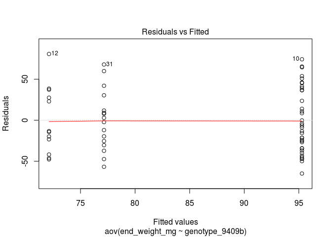
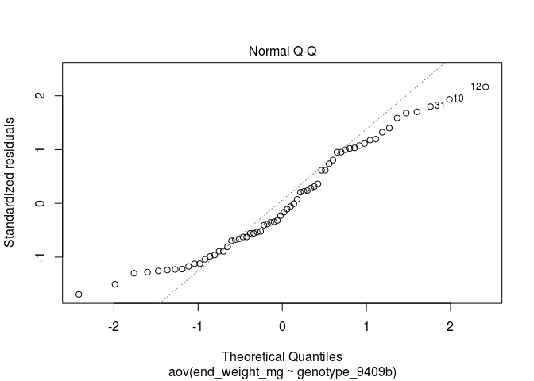
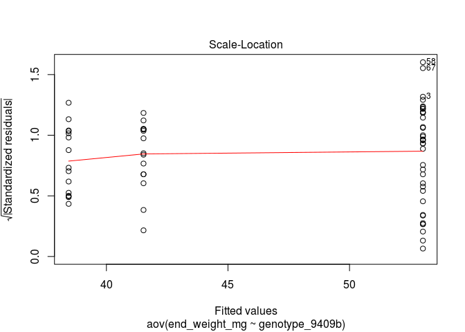
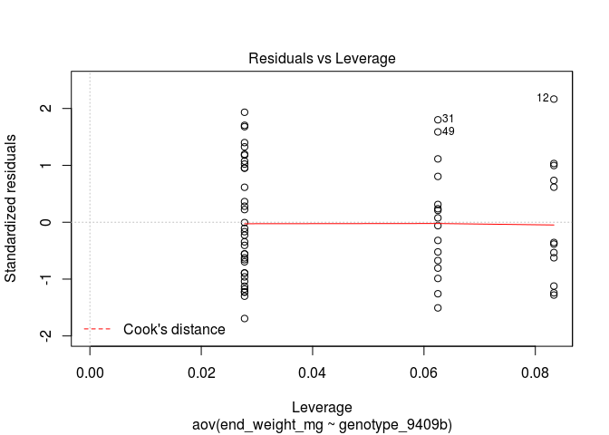
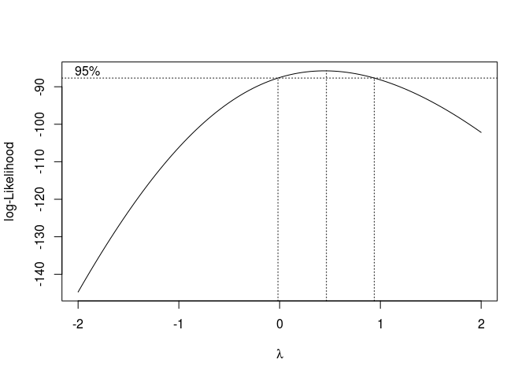

Linkage analysis for H.zea CHR13 marker with larval growth
================
Katherine Taylor and Megan Fritz
written Jan. 8, 2021

## First Mapping family - untreated vs. Cry1Ab leaf tissue incorporation assay

A single F2 mapping family was generated and split into two groups at 48h after hatching - half were placed on diet with untreated leaf tissue (blue), the other half were placed on diet containing Cry1Ab treated leaf tissue (orange). A second F2 mapping family was generated and split into two groups at 48h after hatching - half were placed on diet containing Cry1A.105 + Cry2Ab2 treated leaf tissue (purple). While we put the other half of the family on diet with untreated leaf tissue from a sweet corn isoline with the same genetic background as the two-toxin treated tissue, the data are not shown for simplicity. All larvae were allowed to feed for 7 days and then weighed.

``` r
#png("BV_BA52_BZM_P11_A1.png", units = "px", height = 600, width = 800)
joined %>%
  filter (genotype_9409b != "") %>%
ggplot(aes(x = genotype_9409b, y = end_weight_mg, fill = TreatByFam, color = TreatByFam )) +
  geom_boxplot(fatten = 1, alpha = 0.8, notch = TRUE) +
  geom_point(position=position_jitterdodge(jitter.width = 0.3)) +
  labs(y = "Weight (mg)", x = "") +
  scale_y_continuous(breaks = c(0, 100, 200, 300)) +
  ylim(0,350) +
  scale_x_discrete(breaks  = c("GG", "AG", "AA"),
                   labels = c("A", "A/V", "V")) +
  scale_fill_manual(name="Treatment By Family",
                         breaks=c("Fam 1 CL", "Fam 1 DD", "Fam 2 DD"),
                         values=c("#E69F00", "#56B4E9", "#9932CC")) +
  scale_color_manual(name="Treatment By Family ",
                         breaks=c("Fam 1 CL", "Fam 1 DD", "Fam 2 DD"),
                         values=c("#E69F00", "#56B4E9", "#9932CC")) 
```

    ## Scale for 'y' is already present. Adding another scale for 'y', which will
    ## replace the existing scale.

    ## notch went outside hinges. Try setting notch=FALSE.
    ## notch went outside hinges. Try setting notch=FALSE.
    ## notch went outside hinges. Try setting notch=FALSE.
    ## notch went outside hinges. Try setting notch=FALSE.
    ## notch went outside hinges. Try setting notch=FALSE.


``` r
#dev.off()
```

## Counts of larvae with each genotype for Fred & test for mendelian seg

``` r
#function for test of mendelian segregation
mendel_seg <- function(obs_genos) {
   exp_props <- c(0.25, 0.5, 0.25)
   chisq.test(x = obs_genos, p = exp_props)
   }

geno9409_dist_BCO805_DD <- as.matrix(table(BV_BA52_BZM_P11_A1_DD$genotype_9409b))#allele freqs diag dose BC0805
print(geno9409_dist_BCO805_DD[-1,])#AA is the derived genotype in the field
```

    ## AA AG GG 
    ## 16 36 12

``` r
mendel_seg(geno9409_dist_BCO805_DD[-1,])
```

    ## 
    ##  Chi-squared test for given probabilities
    ## 
    ## data:  obs_genos
    ## X-squared = 1.5, df = 2, p-value = 0.4724

``` r
geno9409_dist_BCO805_CL <- as.matrix(table(BV_BA52_BZM_P11_A1_CL$genotype_9409b))#allele freqs control diet
print(geno9409_dist_BCO805_CL[-1,])#AA is the derived genotype in the field
```

    ## AA AG GG 
    ## 17 23 15

``` r
mendel_seg(geno9409_dist_BCO805_CL[-1,])
```

    ## 
    ##  Chi-squared test for given probabilities
    ## 
    ## data:  obs_genos
    ## X-squared = 1.6182, df = 2, p-value = 0.4453

## Anova and data transformation

We check the assumptions with plots and a shapiro test and then run a boxcox test to determine the appropiate transformation. The lambda value of ~0.5 suggests a square root transformation for individuals on treated diet. Nothing needed for controls.

Progeny on treated diet

``` r
fitDD <- aov(end_weight_mg ~ genotype_9409b, data = BV_BA52_BZM_P11_A1_DD)

shapiro.test(resid(fitDD))
```

    ## 
    ##  Shapiro-Wilk normality test
    ## 
    ## data:  resid(fitDD)
    ## W = 0.95212, p-value = 0.01457

``` r
plot(fitDD)
```



``` r
boxcox(fitDD, plotit = TRUE)
```



Progeny on untreated diet

``` r
fitCL <- aov(end_weight_mg ~ genotype_9409b, data = BV_BA52_BZM_P11_A1_CL)

shapiro.test(resid(fitCL))#no transformation needed.
```

    ## 
    ##  Shapiro-Wilk normality test
    ## 
    ## data:  resid(fitCL)
    ## W = 0.97407, p-value = 0.2786

``` r
plot(fitCL)
```


``` r
boxcox(fitCL, plotit = TRUE)
```


For progeny on treated diet, trying a non-parametric test because the residuals are not normally distributed.

``` r
kruskal.test(end_weight_mg ~ genotype_9409b, data = BV_BA52_BZM_P11_A1_DD)
```

    ## 
    ##  Kruskal-Wallis rank sum test
    ## 
    ## data:  end_weight_mg by genotype_9409b
    ## Kruskal-Wallis chi-squared = 3.586, df = 2, p-value = 0.1665

Then tried a parametric test with sqrt transformed responses.

``` r
fit_BV_BA52_BZM_P11_A1_DD <- aov(sqrt(end_weight_mg) ~ genotype_9409b, data = BV_BA52_BZM_P11_A1_DD)
summary(fit_BV_BA52_BZM_P11_A1_DD)
```

    ##                Df Sum Sq Mean Sq F value Pr(>F)  
    ## genotype_9409b  2  22.61   11.30   2.463 0.0936 .
    ## Residuals      61 279.96    4.59                 
    ## ---
    ## Signif. codes:  0 '***' 0.001 '**' 0.01 '*' 0.05 '.' 0.1 ' ' 1

``` r
shapiro.test(resid(fit_BV_BA52_BZM_P11_A1_DD))#transformation worked
```

    ## 
    ##  Shapiro-Wilk normality test
    ## 
    ## data:  resid(fit_BV_BA52_BZM_P11_A1_DD)
    ## W = 0.97051, p-value = 0.1286

Just ran parametric test for individuals raised up on untreated diet.

``` r
fit_BV_BA52_BZM_P11_A1_CL <- aov(end_weight_mg ~ genotype_9409b, data = BV_BA52_BZM_P11_A1_CL)
summary(fit_BV_BA52_BZM_P11_A1_CL)
```

    ##                Df Sum Sq Mean Sq F value Pr(>F)  
    ## genotype_9409b  2  22087   11044   2.432 0.0978 .
    ## Residuals      52 236134    4541                 
    ## ---
    ## Signif. codes:  0 '***' 0.001 '**' 0.01 '*' 0.05 '.' 0.1 ' ' 1

``` r
shapiro.test(resid(fit_BV_BA52_BZM_P11_A1_CL))#shows no transformation needed.
```

    ## 
    ##  Shapiro-Wilk normality test
    ## 
    ## data:  resid(fit_BV_BA52_BZM_P11_A1_CL)
    ## W = 0.97407, p-value = 0.2786

# What about a glm?

Blocking on square because individuals within the same square got diet from the same syringe.

``` r
library(lme4)
```

    ## Loading required package: Matrix

``` r
fit_glmF <- lmer(sqrt(end_weight_mg) ~ 1 + genotype_9409b + (1|square), data = BV_BA52_BZM_P11_A1_DD)
fit_glmR <- lmer(sqrt(end_weight_mg) ~ 1 + (1|square), data = BV_BA52_BZM_P11_A1_DD)

summary(fit_glmF)
```

    ## Linear mixed model fit by REML ['lmerMod']
    ## Formula: sqrt(end_weight_mg) ~ 1 + genotype_9409b + (1 | square)
    ##    Data: BV_BA52_BZM_P11_A1_DD
    ## 
    ## REML criterion at convergence: 274.8
    ## 
    ## Scaled residuals: 
    ##     Min      1Q  Median      3Q     Max 
    ## -1.8715 -0.7711 -0.1183  0.8895  1.9493 
    ## 
    ## Random effects:
    ##  Groups   Name        Variance Std.Dev.
    ##  square   (Intercept) 0.1109   0.333   
    ##  Residual             4.4924   2.120   
    ## Number of obs: 64, groups:  square, 7
    ## 
    ## Fixed effects:
    ##                  Estimate Std. Error t value
    ## (Intercept)        8.5444     0.5464  15.638
    ## genotype_9409bAG   0.9909     0.6406   1.547
    ## genotype_9409bGG  -0.3358     0.8137  -0.413
    ## 
    ## Correlation of Fixed Effects:
    ##             (Intr) g_9409A
    ## gnty_9409AG -0.811        
    ## gnty_9409GG -0.636  0.542

``` r
anova(fit_glmR, fit_glmF)#adding the blocking factor doesn't help.
```

    ## refitting model(s) with ML (instead of REML)

    ## Data: BV_BA52_BZM_P11_A1_DD
    ## Models:
    ## fit_glmR: sqrt(end_weight_mg) ~ 1 + (1 | square)
    ## fit_glmF: sqrt(end_weight_mg) ~ 1 + genotype_9409b + (1 | square)
    ##          Df    AIC    BIC  logLik deviance  Chisq Chi Df Pr(>Chisq)  
    ## fit_glmR  3 286.77 293.25 -140.38   280.77                           
    ## fit_glmF  5 286.06 296.86 -138.03   276.06 4.7036      2     0.0952 .
    ## ---
    ## Signif. codes:  0 '***' 0.001 '**' 0.01 '*' 0.05 '.' 0.1 ' ' 1

``` r
#forcing full model effects without the slope.
fit_glmF2 <- lmer(sqrt(end_weight_mg) ~ 0 + genotype_9409b + (1|square), data = BV_BA52_BZM_P11_A1_DD)
summary(fit_glmF2)
```

    ## Linear mixed model fit by REML ['lmerMod']
    ## Formula: sqrt(end_weight_mg) ~ 0 + genotype_9409b + (1 | square)
    ##    Data: BV_BA52_BZM_P11_A1_DD
    ## 
    ## REML criterion at convergence: 274.8
    ## 
    ## Scaled residuals: 
    ##     Min      1Q  Median      3Q     Max 
    ## -1.8715 -0.7711 -0.1183  0.8895  1.9493 
    ## 
    ## Random effects:
    ##  Groups   Name        Variance Std.Dev.
    ##  square   (Intercept) 0.1109   0.333   
    ##  Residual             4.4924   2.120   
    ## Number of obs: 64, groups:  square, 7
    ## 
    ## Fixed effects:
    ##                  Estimate Std. Error t value
    ## genotype_9409bAA   8.5444     0.5464   15.64
    ## genotype_9409bAG   9.5353     0.3762   25.34
    ## genotype_9409bGG   8.2087     0.6284   13.06
    ## 
    ## Correlation of Fixed Effects:
    ##             g_9409AA g_9409AG
    ## gnty_9409AG 0.072            
    ## gnty_9409GG 0.046    0.062

``` r
#now for the controls
fit_glmF <- lmer(end_weight_mg ~ 1 + genotype_9409b + (1|square), data = BV_BA52_BZM_P11_A1_CL)
fit_glmR <- lmer(end_weight_mg ~ 1 + (1|square), data = BV_BA52_BZM_P11_A1_CL)

summary(fit_glmF)
```

    ## Linear mixed model fit by REML ['lmerMod']
    ## Formula: end_weight_mg ~ 1 + genotype_9409b + (1 | square)
    ##    Data: BV_BA52_BZM_P11_A1_CL
    ## 
    ## REML criterion at convergence: 587.3
    ## 
    ## Scaled residuals: 
    ##     Min      1Q  Median      3Q     Max 
    ## -2.3194 -0.5340  0.1167  0.4433  1.7867 
    ## 
    ## Random effects:
    ##  Groups   Name        Variance Std.Dev.
    ##  square   (Intercept) 1399     37.40   
    ##  Residual             3400     58.31   
    ## Number of obs: 55, groups:  square, 7
    ## 
    ## Fixed effects:
    ##                  Estimate Std. Error t value
    ## (Intercept)        234.40      20.71  11.319
    ## genotype_9409bAG   -41.78      19.50  -2.143
    ## genotype_9409bGG   -68.84      22.18  -3.103
    ## 
    ## Correlation of Fixed Effects:
    ##             (Intr) g_9409A
    ## gnty_9409AG -0.551        
    ## gnty_9409GG -0.522  0.534

``` r
anova(fit_glmR, fit_glmF)#but the controls look like there may be statistically significant differences in growth.
```

    ## refitting model(s) with ML (instead of REML)

    ## Data: BV_BA52_BZM_P11_A1_CL
    ## Models:
    ## fit_glmR: end_weight_mg ~ 1 + (1 | square)
    ## fit_glmF: end_weight_mg ~ 1 + genotype_9409b + (1 | square)
    ##          Df    AIC    BIC  logLik deviance  Chisq Chi Df Pr(>Chisq)  
    ## fit_glmR  3 624.76 630.78 -309.38   618.76                           
    ## fit_glmF  5 620.07 630.11 -305.04   610.07 8.6901      2    0.01297 *
    ## ---
    ## Signif. codes:  0 '***' 0.001 '**' 0.01 '*' 0.05 '.' 0.1 ' ' 1

## Excluding small individuals. Some progeny were still alive but with failure to thrive phenotypes.

Removing small individuals BV\_BA52\_BZM\_P11\_A1\_DD does not change the outcome.

## Second Mapping family - Cry1A.105 + Cry2Ab2 leaf tissue incorporation assay

All larvae were allowed to feed for 7 days and then weighed.
